# Integrate Authentication and Authorization into Brewz SPA application

The Brewz developers have already completed the work to integrate the SPA application with Azure for authentication. Since they are integrating with Azure, they chose the [Microsoft Authentication Library (MSAL)](https://learn.microsoft.com/en-us/azure/active-directory/develop/msal-overview) for which provides a Javascript API for ease of integration into their SPA. The result of this integration work can be seen in the [source code of the Brewz SPA](https://github.com/f5devcentral/spa-demo-app/tree/main/spa).

For detailed information about how the Brewz application registrations for the SPA and API components were set up in Azure, refer to the following procedures:

- [Register an application with the Microsoft identity platform](https://learn.microsoft.com/en-us/azure/active-directory/develop/quickstart-register-app)

- [Configure an application to expose a web API](https://learn.microsoft.com/en-us/azure/active-directory/develop/quickstart-configure-app-expose-web-apis)

For testing purposes, anyone that has an account within F5's Azure Active Directory will be able to sign in to the Brewz application. If the user clicks the **Sign In** and is not already authenticated, they will be redirected to Azure to sign in authorize the Brewz application to use their basic profile information. Once the user is authenticated and authorization is complete, they will be redirected back to the Brewz application where they will be able to continue the checkout process.

## Enabling security in the SPA

The Brewz developers have made use of a feature flag in the SPA application to expose the areas of the application that require a login.

1. Open the **Brewz** UDF access method on the **k3s** component.

1. Add at least one item to your shopping cart.

1. Click the **Shopping Cart** button. Note that there is no **Checkout** button in the Shopping Cart view.

1. In the URL, replace `cart` with `config` and hit enter. You will be presented with the config view:

    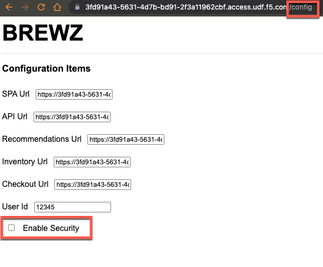

1. Check the checkbox by **Enable Security**, then refresh your browser.

1. Click the **BREWZ** title to navigate to the product view. You should now see a **Sign In** button in the header:

    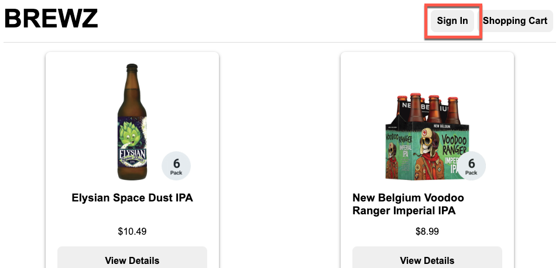

1. Click the **Shopping Cart** button, then click the **Proceed to Checkout** button at the bottom of the view.

    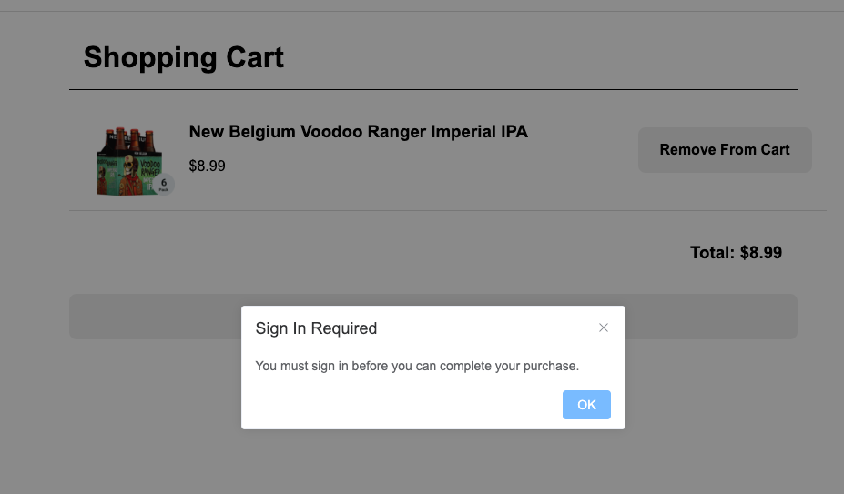

    > **Note:** The application contains logic that will not let you proceed to protected views unless you are signed in.

## Sign In

1. Click the **Sign In** button in the navigation header. If you are not signed into your Microsoft account, you should be redirected to Microsoft's sign in pages and will see the following prompts. If you are already signed in, jump directly to [Authorize the Brewz App](#authorize-the-brewz-app).

1. If prompted, pick your F5 Microsoft account by clicking on it:

    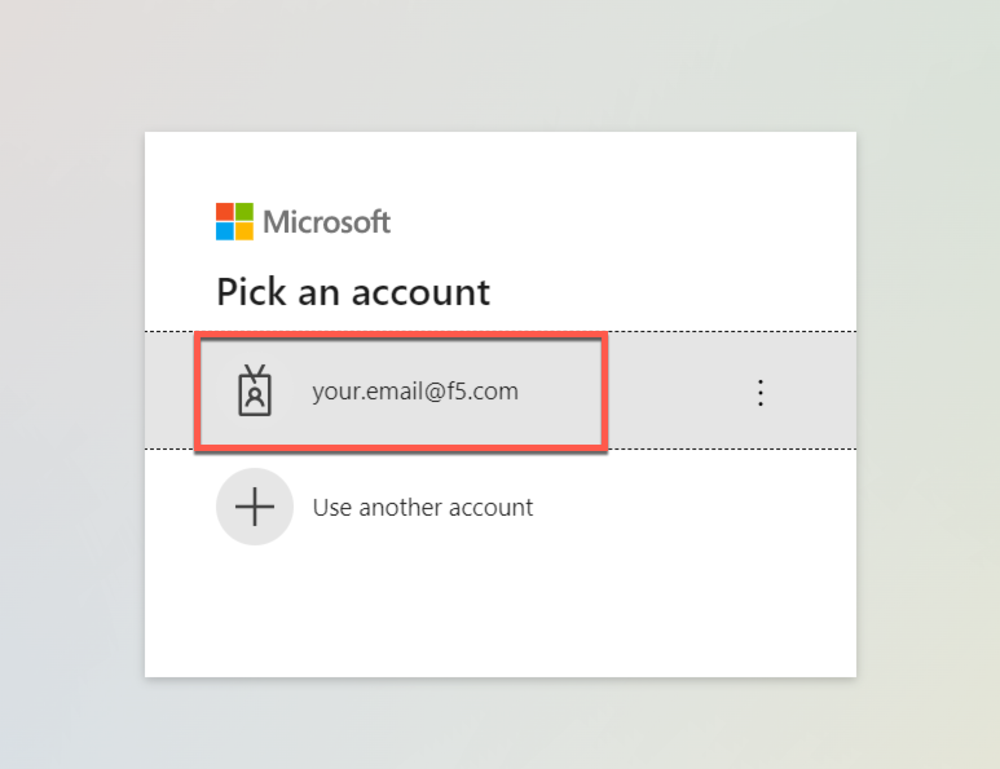

1. On the email page, enter your full F5 email address. Do not enter an email alias.

    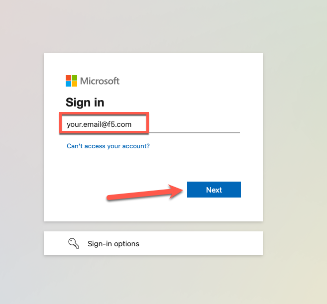

1. On the password page, enter your F5 account password, and click **Sign In**.

    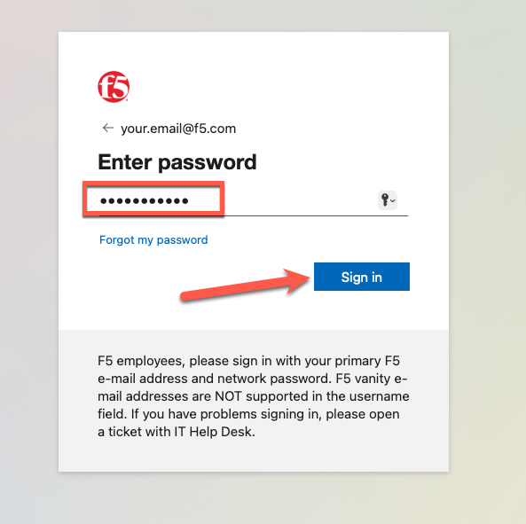

1. If you are prompted to **Stay Signed In**, you may pick either option you prefer to continue.

    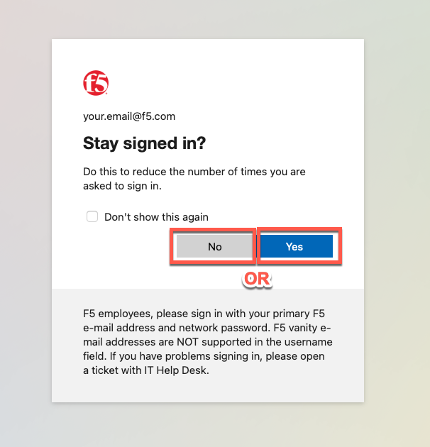

## Authorize the Brewz App

If this is your first time signing into the Brewz application, you will need to authorize it to access your account information. If you previously authorized the Brewz application, you will not see the following prompt so continue to the next section.

1. Click the **Authorize** button:

    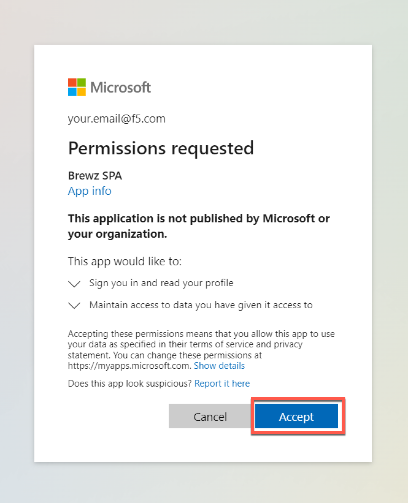

## Signed In

Once sign in and authorization is complete, you should be redirected back to the Brewz application. Notice additional links and buttons now appear in the navigation bar:

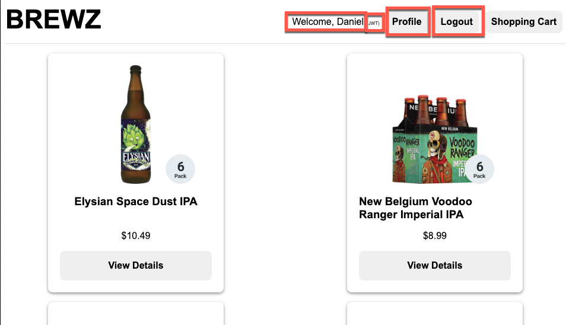

1. Click the **Shopping Cart** button, then click the **Proceed to Checkout** button at the bottom of the view. The **Checkout** view will appear:

    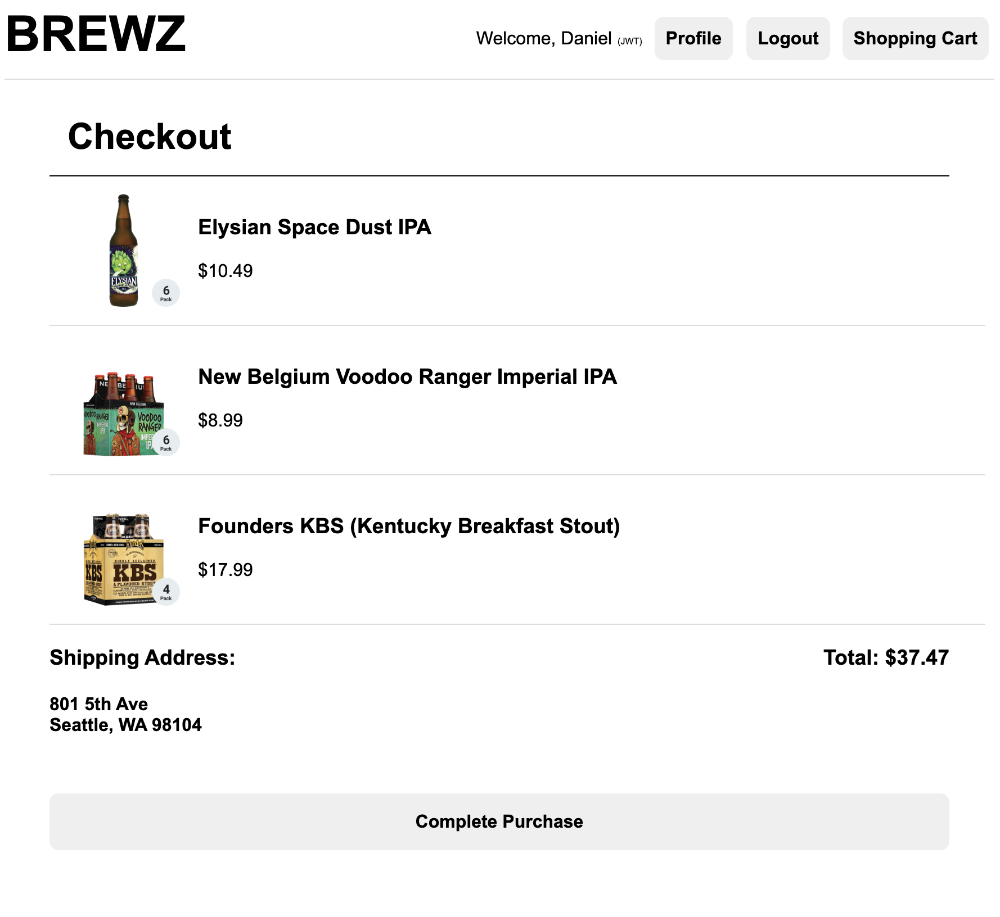

1. In your browser, open the developer tools window. Open the **Network** pane so that you can see the API calls that are made for the next step. Specific steps will likely vary based upon your browser of choice.

1. Click the **Complete Purchase** button at the bottom of the view. The SPA will then show a **Purchase Complete** dialog showing an Order ID.

1. In your developer toolbar, see that the SPA app has invoked a `POST` method on the `/api/order` URI. `Order` is an operation on the **Checkout** service we deployed earlier:

    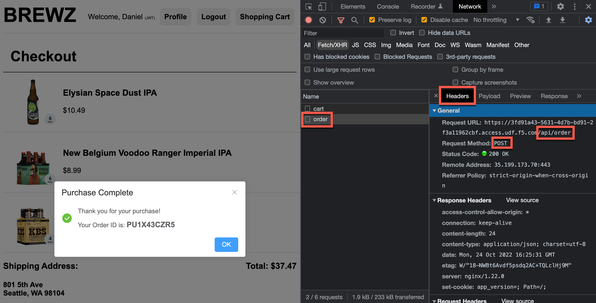

1. Click the **Payload** tab in your developer toolbar. See that the SPA app passed the cart items, a shipping address an a user ID to the service.

    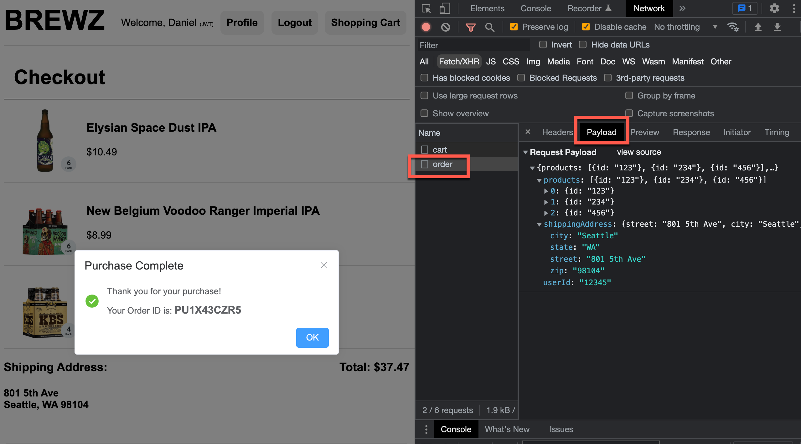

1. Click the **Response** tab in your developer toolbar. The value of the `orderId` JSON property should match what is displayed on the SPA.

    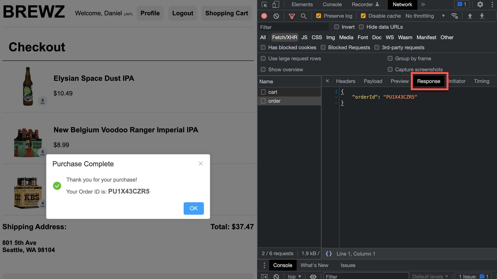

1. Click the headers toolbar once again in your developer toolbar. Scroll until **Request Headers** is in view. Note the `Authorization: Bearer...` token. This is the JWT token for the Brewz API that the SPA is sending to the Checkout service when placing an order.

    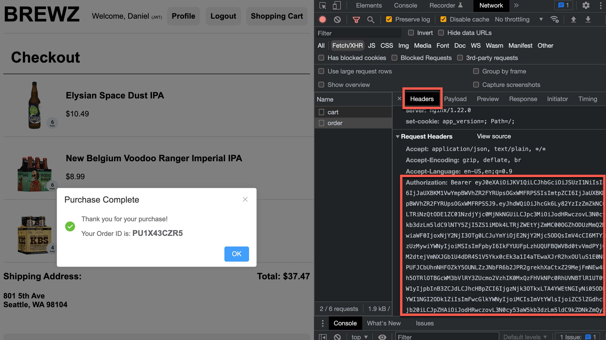

    What is in this JWT token?

## Next Steps

Next, we will [inspect the contents of this JWT token](jwt-token.md).
