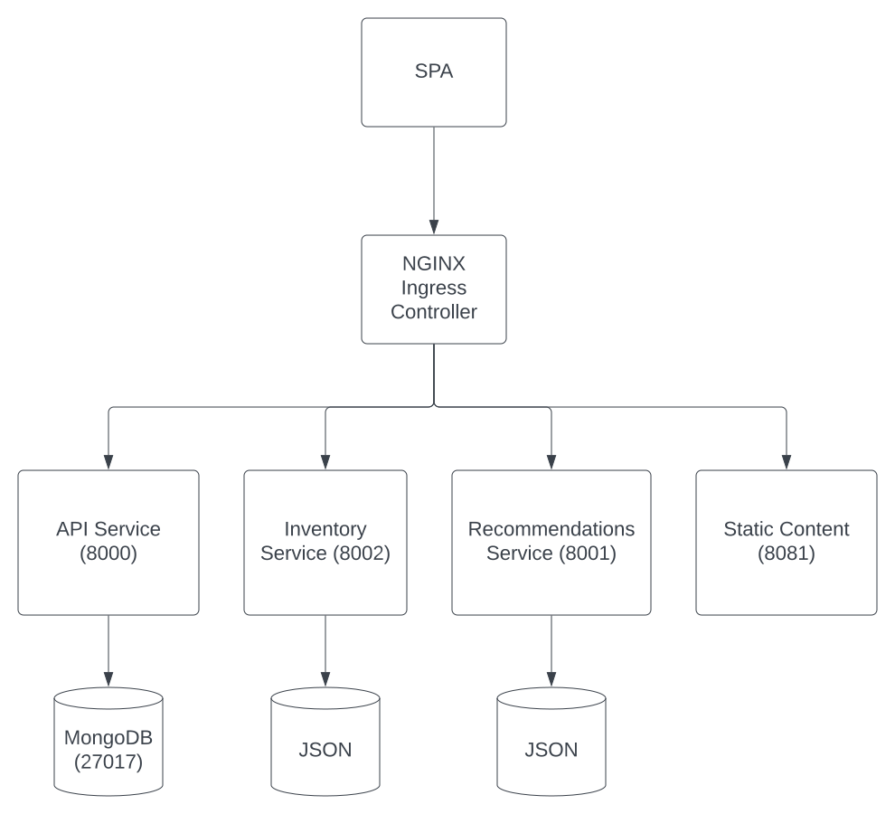
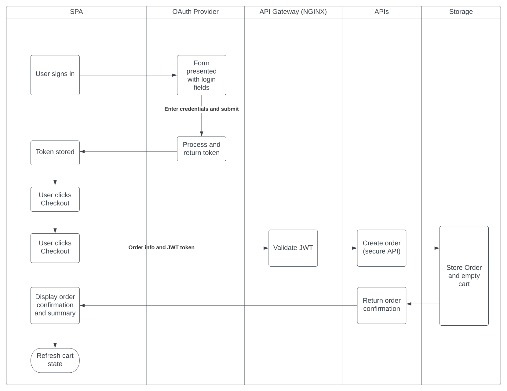

# The Checkout process in the Brewz application

The Brewz application is the online e-commerce site for the Brewz company; a regional chain of craft brew stores with national and global growth aspirations.

As a reminder, if you have completed the earlier labs in this workshop, you would have learned about the Brewz company, and their digital transformation efforts to date. If not, you can read about them [here](../scenario/README.md#brewz-company-overview).

In the setup steps, you deployed the Brewz microservices application into Kubernetes as the starting point for this lab. Right now, this is a basic depiction of how the application and its services are deployed in Kubernetes:

The Brewz company has determined that they need to build a specific microservice dedicated to the checkout process, and secure it so that only authenticated users can utilize it. But how will they implement this?

It may come as no surprise that common to many organizations, the Brewz company's developers don't have much experience in secure development. The fact is, security coding is difficult, and requires lots of knowledge and specialized experience in a constantly evolving discipline. Since the Brewz application owners would rather invest in enhancing their platform than building their own security stack, they will instead leverage proven security standards and integrate with platforms that can provide security as a service.

The Brewz company's product managers have determined that since most of their existing and prospective customers already have Microsoft identities from work, school or personal use, they will leverage the Azure identity and authorization services.

While it is true that the Brewz developers will need to become familiar with how specifications like OIDC, OAuth2, and JWT work, they will not need to become experts in them, and can instead focus on enhancing their e-commerce application.

> **Note:** If you are new to the specifications listed above, take some time to familiarize yourself with them. Deep knowledge in these specifications are not required to proceed with this lab.

Simply put, we will use:

- OIDC and OAuth 2 for authentication and authorization services, provided by Microsoft Azure
- JWT tokens for authorizing access to APIs that need to be secured

Since Brewz is implemented as a SPA application, the security implementations used must not expose any sensitive keys or tokens to the user, as the application code is easily inspected within the browser using developer tools. Since this is the case, we will be leveraging PKCE flow, so that sensitive information is not disclosed.

The following is a simplified overview of how the checkout process will interact with Brewz services as well as NGINX as a security enforcement point, and the Azure identity provider services:

Most everything appearing in the diagram above will need to be implemented and deployed. Foremost, there appears a *Create order* service in the diagram above.

## Next Steps

Good news! The Brewz developers have created the new Checkout microservice, and we will deploy it in the [next steps](checkout-service.md).
