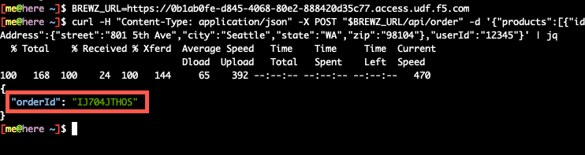

# Deploy the Checkout service

The Checkout service is another microservice developed in Node JS using the Express framework, similar to the other microservices in the Brewz application deployment.


It has been packaged into a container that will respond to requests on port 8003. The SPA application will interact with it through NGINX acting as an API Gateway.

## Deploying the Checkout service

First, we need to modify our existing Brewz manifests to add a `Deployment` resource spec. We will also add a new `Service` resource to reach this new microservice. Finally, we will add an upstream for this service, and configure the Virtual Server to route traffic to the new service.

1. In your fork of the lab repository, use VSCode to append the following yaml snippet to the `manifests/brewz/app.yaml` file and save it:

    ```yaml
    ---
    apiVersion: apps/v1
    kind: Deployment
    metadata:
      name: checkout
    spec:
      replicas: 1
      selector:
        matchLabels:
          app: checkout
      template:
        metadata:
          labels:
            app: checkout
        spec:
          containers:
            - name: checkout
              image: ghcr.io/f5devcentral/spa-demo-app-checkout:sha-ec8dec7
              ports:
                - containerPort: 8003
    ---
    apiVersion: v1
    kind: Service
    metadata:
      name: checkout
    spec:
      ports:
        - port: 8003
          targetPort: 8003
          protocol: TCP
          name: http
      selector:
        app: checkout

    ```

1. Append the following yaml snippet to the list of `upstreams` in the `manifests/brewz/virtual-server.yaml` file:

    ```yaml
        - name: checkout
          service: checkout
          port: 8003
    ```

1. Append the following yaml snippet to the list of `routes` in the `manifests/brewz/virtual-server.yaml` file:

    ```yaml
        - path: /api/order
          action:
            proxy:
              upstream: checkout
              rewritePath: /api/order
    ```

1. The `virtual-server.yaml` file should now look like the following:

    ```yaml
    ---
    apiVersion: k8s.nginx.org/v1
    kind: VirtualServer
    metadata:
      name: brewz
    spec:
      host: brewz.f5demo.com
      tls:
        secret: brewz-tls
      policies:
        - name: waf-policy
      upstreams:
        - name: spa
          service: spa
          port: 8080
        - name: api
          service: api
          port: 8000
          healthCheck:
            enable: true
            path: /api/stats
            interval: 20s
            jitter: 3s
            port: 8000
        - name: inventory
          service: inventory
          port: 8002
        - name: recommendations
          service: recommendations
          port: 8001
        - name: spa-dark
          service: spa-dark
          port: 8080
        - name: checkout
          service: checkout
          port: 8003
      routes:
        - path: /
          matches:
            - conditions:
              - cookie: "app_version"
                value: "dark"
              action:
                pass: spa-dark
          action:
            pass: spa
        - path: /api
          policies:
            - name: rate-limit-policy
          action:
            pass: api
          errorPages:
            - codes: [404]
              return:
                code: 404
                type: application/json
                body: |
                  {\"msg\": \"Could not find the resource!\"}
                headers:
                  - name: x-debug-original-status
                    value: ${upstream_status}
        - path: /api/inventory
          action:
            proxy:
              upstream: inventory
              rewritePath: /api/inventory
        - path: /api/recommendations
          action:
            proxy:
              upstream: recommendations
              rewritePath: /api/recommendations
        - path: /images
          action:
            proxy:
              upstream: api
              rewritePath: /images
        - path: /api/order
          action:
            proxy:
              upstream: checkout
              rewritePath: /api/order

    ```

1. Commit the `manifests/brewz/virtual-server.yaml` and `manifests/brewz/app.yaml` files to your local repository, then push them to your remote repository. ArgoCD will pick up the most recent changes, and deploy them for you.

    > **Note:** ArgoCD does not *immediately* detect changes. By default, it checks the repository for changes every 3 minutes. You can click the **Refresh** button on the **brewz** application in ArgoCD to immediately check for updated repository contents. If any are detected, ArgoCD will initiate a sync.

1. Open ArgoCD using the UDF access method (as you did earlier in this lab) to verify that the Brewz app is in a healthy state and in sync.

1. Open the **Brewz** UDF access method on the **k3s** component. Note that the application looks the same as it has been in previous labs.

1. Now, call the newly deployed Checkout service directly. Copy the URL (without the path) from your browser in the above step, and test the service by running the following from your laptop using the `cURL` utility replacing the `<Brewz UDF access method url>`:

    ```bash
    BREWZ_URL=<Brewz UDF access method url>

    curl -H "Content-Type: application/json" -X POST "$BREWZ_URL/api/order" -d '{"products":[{"id":"234"},{"id":"456"}],"shippingAddress":{"street":"801 5th Ave","city":"Seattle","state":"WA","zip":"98104"},"userId":"12345"}' | jq
    ```

    You should receive an order ID if the API call is successful:

    

    > **Note:** This API call was allowed without providing any authorization attributes. These will be added later on in the lab in order to protect this API.

## Next Steps

Next, integrate [authentication and authorization into the Brewz SPA application](brewz-spa-auth.md).
