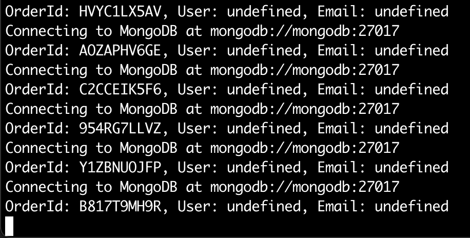
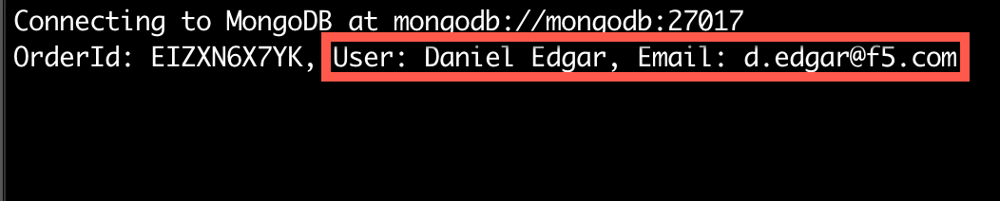

# Pass claim data to the upstream Checkout API

The Brewz company developed the Checkout service with some audit logging requirements when an order is created. They have already added the code to log  the customer name and email address when an order is placed. The good news is, NGINX Ingress Controller can extract claim information, and send it to the upstream.

## Follow the existing Checkout logs

1. Run the following command from your local machine to follow the Checkout pod's logs:

    ```bash
    CHECKOUT_POD=`kubectl get pods -o json | jq '.items[] | select(.metadata.name | startswith("checkout")) | .metadata.name' -r`
    kubectl logs $CHECKOUT_POD -f
    ```

    If the above command fails, it may be that the `KUBECONFIG` variable has not been set in your current shell session. Visit [setup](setup.md#generate-local-kubeconfig) if you need to set it again.

    > **Note:** At times, the log stream may stop. If you are not seeing events appear after some time, type `ctrl+c` and attempt to stream logs again.

1. You should be presented with logs from prior Checkout service invocations. The logging code is expecting a `User` and `Email` header to be present in the order POST request, [according to the code](https://github.com/f5devcentral/spa-demo-app/blob/ed8115a684ed918f73d01d61c831c8439409cbec/checkout/paths/order.js#L13). However, since these headers are not populated, they appear as `undefined` in the log entries. Let's fix that.

    

## Configure NGINX to pass claim information

1. In VSCode, open the `manifests/brewz/virtual-server.yaml` file. Update the `/api/order` route's `proxy` object with the additional `requestHeaders` YAML as shown here:

    ```yaml
        - path: /api/order
          policies:
            - name: jwt-policy
          action:
            proxy:
              upstream: checkout
              rewritePath: /api/order
              requestHeaders:
                set:
                  - name: User
                    value: ${jwt_claim_name}
                  - name: Email
                    value: ${jwt_claim_email}
          errorPages:
            - codes: [401]
              return:
                code: 401
                type: application/json
                body: |
                  {\"msg\": \"Authorization Required\"}
                headers:
                  - name: x-debug-original-status
                    value: ${upstream_status}
    ```

1. Save the file, and stage the changes.

1. Commit the changes to your local repository.

1. Push the changes to your remote repository.

1. ArgoCD will detect the changes to your repository, and will update the Brewz app deployment.

## Verify claim information in logs

1. Open the **Brewz** UDF access method on the **k3s** component.

1. If not signed in, do so as you have earlier in the lab.

1. Click **Shopping Cart**. If there are no items in your shopping cart, click the **BREWZ** title link and add at least one items to your cart, then navigate back to the **Shopping Cart** view.

1. Click the **Proceed to Checkout** button at the bottom of the view.

1. Click the **Complete Purchase** button at the bottom of the view. The SPA will show a **Purchase Complete** dialog showing an Order ID.

1. Re-examine the Checkout service logs. You should see an entry similar to the following:

    

    You should see that the logs are now populated with the additional values that NGINX Ingress Controller parsed out of the JWT payload and injected into the upstream headers.

    > **Note:** If you do not see new log entries after placing an order, the log stream may have stopped. Type `ctrl+c` and attempt to stream logs again.

## End of Lab

Microservices API Security lab complete. Return to [workshop index](../README.md).
