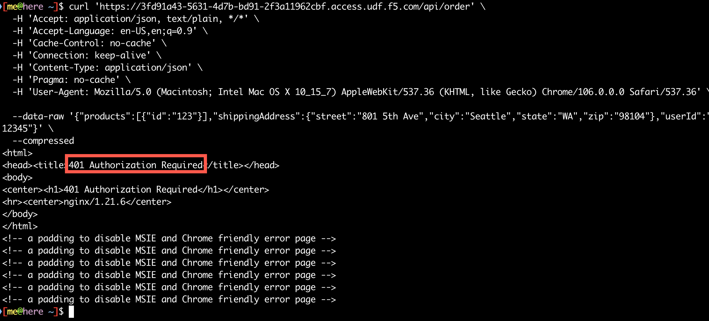
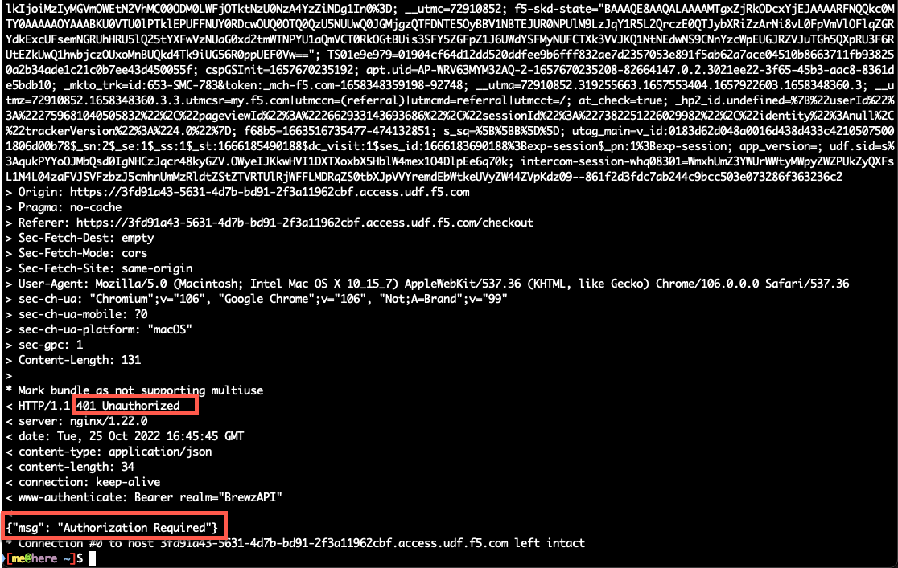

# Use NGINX Ingress Controller to inspect and enforce JWT

Though we just discovered that the Brewz API JWT is not being enforced, the good news is that we don't have to rely on developer code to inspect and enforce this JWT for us. As mentioned in the outset of this lab, security development is hard to get right. Why would we want to implement our own security measures on our microservices? Additionally, many organizations have multiple APIs that have security requirements. Why would we want to implement duplicate code across all of our services?

We are already using NGINX Ingress Controller as an API Gateway - the ideal location to provide security enforcement. It is already decrypting our request traffic to make routing decisions, rate-limit traffic as well as using its WAF to prevent the exploitation of vulnerabilities. It makes sense to implement this additional security control at this tier, instead of adding an additional tier to do so. NGINX Ingress Controller based on NGINX Plus already has JWT introspection and enforcement capabilities, and we can enable these via a `Policy` resource on our existing `VirtualServer` resource. Let's get started.

## JSON Web Key Sets for JWT signing

Public keys are used to verify the cryptographic authenticity of the JWT token to ensure that their contents are from the expected issuer (Azure), and that their contents have not been tampered with since it was issued. Like the JWT, the structure of the keys are also expressed as JSON structure, called a [JSON Web Key Set (JWKS)](https://datatracker.ietf.org/doc/html/rfc7517#section-5).

At the time of this writing, NGINX Ingress Controller cannot download a JWKS from a remote location. Instead, we must download the key set JSON, then store it as a secret in Kubernetes.

Where do we get the JWKS? It will vary per authentication provider. Azure makes them publicly available for download based on your tenant ID, but not well documented. [This](https://www.nginx.com/blog/secure-api-access-with-nginx-and-azure-active-directory/#Configure-JWT-Assertion-in-API-Connectivity-Manager) seems to be the best resource I have seen on the topic. However, we will provide you the JWKS for this lab.

## Create the JWKS as a secret in Kubernetes

We will create a `Secret` resource in Kubernetes to store the JWKS. Even though the JWKS is typically expressed as a JSON object, [we need to base64 encode it](https://kubernetes.io/docs/concepts/configuration/secret/#restriction-names-data) before creating it in Kubernetes if using the `data` field. This had already been encoded for you.

1. In VS Code, create a `manifests/brewz/jwk-secret.yaml` file in your repository with the following contents:

    ```yaml
    apiVersion: v1
    kind: Secret
    metadata:
      name: jwk-secret
    type: nginx.org/jwk
    data:
      jwk: eyJrZXlzIjpbeyJrdHkiOiJSU0EiLCJ1c2UiOiJzaWciLCJraWQiOiJuT28zWkRyT0RYRUsxaktXaFhzbEhSX0tYRWciLCJ4NXQiOiJuT28zWkRyT0RYRUsxaktXaFhzbEhSX0tYRWciLCJuIjoib2FMTFQ5aGtjU2oydEdmWnNqYnU3WHoxS3JzMHFFaWNYUG1Fc0pLT0JRSGF1Wl9rUk0xSGRFa2dPSmJVem5Vc3BFNnhPdU9TWGpsekVycUJ4WEF1NFNDdmN2Vk9DWUcydjlHMy11SXJMRjVkc3REMHNZSEJvMVZvbXRLeHpGOTBWc2xya242ck5RZ1VHSVdndnVRVHhtMXVSa2xZRlBFY1RJUncwTG5Za256SjA2R0M5bGpLUjYxN3dBQlZyWk5rQnVEZ1FLajM3cWN5eG9heElHZHhFY21WRlpYSnlyeERnZFhoOW93Um1abjZMSUpsR2paOW01OWVtZnV3bkJuc0lRRzdEaXJKd2U5U1hyTFhuZXhSUVdxeXpDZGtZYU9xa3BLcnNqdXhVajItTUhYMzFGcXNkcEpKc09BdllYR09ZQktKUmpoR3JHZE9OVnJaZFVkVEJRIiwiZSI6IkFRQUIiLCJ4NWMiOlsiTUlJREJUQ0NBZTJnQXdJQkFnSVFOMzNST2FJSjZiSkJXREN4dG1KRWJqQU5CZ2txaGtpRzl3MEJBUXNGQURBdE1Tc3dLUVlEVlFRREV5SmhZMk52ZFc1MGN5NWhZMk5sYzNOamIyNTBjbTlzTG5kcGJtUnZkM011Ym1WME1CNFhEVEl3TVRJeU1USXdOVEF4TjFvWERUSTFNVEl5TURJd05UQXhOMW93TFRFck1Da0dBMVVFQXhNaVlXTmpiM1Z1ZEhNdVlXTmpaWE56WTI5dWRISnZiQzUzYVc1a2IzZHpMbTVsZERDQ0FTSXdEUVlKS29aSWh2Y05BUUVCQlFBRGdnRVBBRENDQVFvQ2dnRUJBS0dpeTAvWVpIRW85clJuMmJJMjd1MTg5U3E3TktoSW5GejVoTENTamdVQjJybWY1RVROUjNSSklEaVcxTTUxTEtST3NUcmprbDQ1Y3hLNmdjVndMdUVncjNMMVRnbUJ0ci9SdC9yaUt5eGVYYkxROUxHQndhTlZhSnJTc2N4ZmRGYkphNUorcXpVSUZCaUZvTDdrRThadGJrWkpXQlR4SEV5RWNOQzUySko4eWRPaGd2Wll5a2V0ZThBQVZhMlRaQWJnNEVDbzkrNm5Nc2FHc1NCbmNSSEpsUldWeWNxOFE0SFY0ZmFNRVptWitpeUNaUm8yZlp1ZlhwbjdzSndaN0NFQnV3NHF5Y0h2VWw2eTE1M3NVVUZxc3N3blpHR2pxcEtTcTdJN3NWSTl2akIxOTlSYXJIYVNTYkRnTDJGeGptQVNpVVk0UnF4blRqVmEyWFZIVXdVQ0F3RUFBYU1oTUI4d0hRWURWUjBPQkJZRUZJNW1ONWZ0SGxvRURWTm9JYThzUXM3a0pBZVRNQTBHQ1NxR1NJYjNEUUVCQ3dVQUE0SUJBUUJuYUdub2p4TmduVjQrVENQWjlicjRveDFuUm45dHpZOGI1cHdLVFcyTWNKVGUweUV2ckh5YUl0SzhLYm1lS0pPQnZBU2YrUXdIa3ArRjJCQVh6UmlUbDRaK2dORlFVTFB6c1FXcG1LbHo2ZklXaGM3a3NncFRrTUs2QWFUYndXWVRmbXBLblF3L0tKbS82cmJvTERXWXlLRnBRY1N0dTY3UlorYVJ2UXo2OEV2MmdhNUpzWGxjT0ozZ1AvbEU1V0MxUzByamZhYnpkTU9HUDhxWlFoWGs0d0JPZ3RGQmFpc0RuYmpWNXBjSXJqUlBsaG9DeHZLZ0MvMjkwblo5L0RMQkgzVGJIazh4d0hYZUJBbkFqeUFxT1ppajkydWtzQXY3WkxxNE1PRGNuUXNoVklOWHdzWXNoRzFwUXFPTHdNZXJ0TmFZNVd0cnViTVJrdTQ0RHc3UiJdLCJpc3N1ZXIiOiJodHRwczovL2xvZ2luLm1pY3Jvc29mdG9ubGluZS5jb20vZTU2OWYyOWUtYjA5OC00Y2VhLWI2ZjAtNDhmYTg1MzJkNjRhL3YyLjAifSx7Imt0eSI6IlJTQSIsInVzZSI6InNpZyIsImtpZCI6Imwzc1EtNTBjQ0g0eEJWWkxIVEd3blNSNzY4MCIsIng1dCI6Imwzc1EtNTBjQ0g0eEJWWkxIVEd3blNSNzY4MCIsIm4iOiJzZnNYTVhXdU8tZG5pTGFJRUxhM1B5cXo5WV9yV2ZmX0FWckNBbkZTZFBIYThfX1Bta2J0X3lxLTZaM3UxbzRnalJwS1ducmp4SWg4ekRuMVoxUlMyNm5rS2NOZzV4Zld4UjJLOENQYlNiWThnTXJwXzRwWm43dGdyRW1vTE1rd2ZnWWFWQy00TWlGRW8xUDJnZDltQ2RnSUlDYU5lWWtHMWJJUFRuYXFxdVRNNUtmVDk3MU1wdU9WT2RNMXlzaWVqZGNORHZFYjd2Mjg0UFlaa3cyaW13cWlCWTNGUjBzVkc3amdLVW90RnZoZDdUUjVXc0EyMEdTXzZaSWtVVWxMVWJHX3JYV0dsMFlqWkxTX1VmNHE4SGJvN3UtN01hRm44QjY5RjZZYUZkRGxYbV9BMFNwZWRWRldRRkd6TXNwNDNfNnZFempmckZESlZBWWt3YjZ4VVEiLCJlIjoiQVFBQiIsIng1YyI6WyJNSUlEQlRDQ0FlMmdBd0lCQWdJUVdQQjFvZk9wQTdGRmxPQms1aVBhTlRBTkJna3Foa2lHOXcwQkFRc0ZBREF0TVNzd0tRWURWUVFERXlKaFkyTnZkVzUwY3k1aFkyTmxjM05qYjI1MGNtOXNMbmRwYm1SdmQzTXVibVYwTUI0WERUSXhNREl3TnpFM01EQXpPVm9YRFRJMk1ESXdOakUzTURBek9Wb3dMVEVyTUNrR0ExVUVBeE1pWVdOamIzVnVkSE11WVdOalpYTnpZMjl1ZEhKdmJDNTNhVzVrYjNkekxtNWxkRENDQVNJd0RRWUpLb1pJaHZjTkFRRUJCUUFEZ2dFUEFEQ0NBUW9DZ2dFQkFMSDdGekYxcmp2blo0aTJpQkMydHo4cXMvV1A2MW4zL3dGYXdnSnhVblR4MnZQL3o1cEc3ZjhxdnVtZDd0YU9JSTBhU2xwNjQ4U0lmTXc1OVdkVVV0dXA1Q25EWU9jWDFzVWRpdkFqMjBtMlBJREs2ZitLV1orN1lLeEpxQ3pKTUg0R0dsUXZ1REloUktOVDlvSGZaZ25ZQ0NBbWpYbUpCdFd5RDA1MnFxcmt6T1NuMC9lOVRLYmpsVG5UTmNySW5vM1hEUTd4Rys3OXZPRDJHWk1Ob3BzS29nV054VWRMRlJ1NDRDbEtMUmI0WGUwMGVWckFOdEJrdittU0pGRkpTMUd4djYxMWhwZEdJMlMwdjFIK0t2QjI2Tzd2dXpHaFovQWV2UmVtR2hYUTVWNXZ3TkVxWG5WUlZrQlJzekxLZU4vK3J4TTQzNnhReVZRR0pNRytzVkVDQXdFQUFhTWhNQjh3SFFZRFZSME9CQllFRkxsUkJTeHhnbU5QT2JDRnJsK2hTc2JjdlJrY01BMEdDU3FHU0liM0RRRUJDd1VBQTRJQkFRQitVUUZUTnM2QlVZM0FJR2tTMlpSdVpnSnNORXIvWkVNNGFDczJkb21kMk9xajcrNWlXc25QaDVDdWdGbkk0bmQrWkxnS1ZIU0Q2YWNRMjd3ZStlTlk2Z3hmcFFDWTFmaU4vdUtPT3NBMElmOEliUGRCRWh0UGVyUmdQSkZYTEhhWVZxRDhVWURvNUtOQ2NvQjRLaDhudkNXUkdQVVVIUFJxcDdBbkFjVnJjYmlYQS9ibU1DbkZXdU5OYWhjYUFLaUpUeFlsS0RhRElpUE4zNXlFQ1liRGowUEJXSlV4b2Jydmo1STI3NWpiaWtrcDhRU0xZblNVL3Y3ZE1EVWJ4U0xmWjd6c1R1YUYyUXgrTDYyUHNZVHdMeklGWDNNOEVNU1E2aDY4VHVwRlRpNW4wTTJ5SVhRZ29Sb05FRFdOSlovYVpNWS9ncVQwMkdRR0JXcmgrL3ZKIl0sImlzc3VlciI6Imh0dHBzOi8vbG9naW4ubWljcm9zb2Z0b25saW5lLmNvbS9lNTY5ZjI5ZS1iMDk4LTRjZWEtYjZmMC00OGZhODUzMmQ2NGEvdjIuMCJ9LHsia3R5IjoiUlNBIiwidXNlIjoic2lnIiwia2lkIjoiTXI1LUFVaWJmQmlpN05kMWpCZWJheGJvWFcwIiwieDV0IjoiTXI1LUFVaWJmQmlpN05kMWpCZWJheGJvWFcwIiwibiI6InlyM3YxdUVUckZmVDE3enZPaXkwMXc4bk8tMXQ2N2NtaVpMWnhxMklTRGR0ZTlkdy1JeENSN2xQVjJ3ZXpjeklSZ2NXbVlnRm5zazJqNm0xMEg0dEt6Y3FaTTBKSl9OaWdZMjlwRmlteGxMN19xWE1CMVBvckZKZGxBS3ZwNVNnalNUd0xyWGprcjFBcVd3YnB6RzJ5WlVOTjNHRThHdm1UZW80eXdlUWJOQ2QteU9fWnBvengwSjM0d0hCRU11YXctWmZDVWs3bWRLS3NnLUVjRTRadjBYZ2w5d1AyTXBLUHgwVjhnTGF6eGU2VVE5U2h6TnVydVNPbmNwTFlKTl9vUTRhS2Y1cHRPcDFyc2ZEWTJJSzlmcnRtUlRLT2RRLU1FbVNkakdMXzg4SVFjdkNzN2pxVno1M1hLb1hSbFhCOHRNSUdPY2ctSUNlcjZ5eGUyaXRJUSIsImUiOiJBUUFCIiwieDVjIjpbIk1JSURCVENDQWUyZ0F3SUJBZ0lRZmY4eXJGTzNDSU5QSFVUVDc2dFVzVEFOQmdrcWhraUc5dzBCQVFzRkFEQXRNU3N3S1FZRFZRUURFeUpoWTJOdmRXNTBjeTVoWTJObGMzTmpiMjUwY205c0xuZHBibVJ2ZDNNdWJtVjBNQjRYRFRJeE1UQXlOREUzTkRVMU5sb1hEVEkyTVRBeU5ERTNORFUxTmxvd0xURXJNQ2tHQTFVRUF4TWlZV05qYjNWdWRITXVZV05qWlhOelkyOXVkSEp2YkM1M2FXNWtiM2R6TG01bGREQ0NBU0l3RFFZSktvWklodmNOQVFFQkJRQURnZ0VQQURDQ0FRb0NnZ0VCQU1xOTc5YmhFNnhYMDllODd6b3N0TmNQSnp2dGJldTNKb21TMmNhdGlFZzNiWHZYY1BpTVFrZTVUMWRzSHMzTXlFWUhGcG1JQlo3Sk5vK3B0ZEIrTFNzM0ttVE5DU2Z6WW9HTnZhUllwc1pTKy82bHpBZFQ2S3hTWFpRQ3I2ZVVvSTBrOEM2MTQ1SzlRS2xzRzZjeHRzbVZEVGR4aFBCcjVrM3FPTXNIa0d6UW5mc2p2MmFhTThkQ2QrTUJ3UkRMbXNQbVh3bEpPNW5TaXJJUGhIQk9HYjlGNEpmY0Q5aktTajhkRmZJQzJzOFh1bEVQVW9jemJxN2tqcDNLUzJDVGY2RU9HaW4rYWJUcWRhN0h3Mk5pQ3ZYNjdaa1V5am5VUGpCSmtuWXhpLy9QQ0VITHdyTzQ2bGMrZDF5cUYwWlZ3ZkxUQ0JqbklQaUFucStzc1h0b3JTRUNBd0VBQWFNaE1COHdIUVlEVlIwT0JCWUVGRGlaRzZzNWQ5UnZvcnBxYlZkUzIvTUQ4WktoTUEwR0NTcUdTSWIzRFFFQkN3VUFBNElCQVFBUUFQdXFxS2oyQWdmQzlheXgrcVV1MHZqektZZFo2VCszc3NKRE9Hd0IxY0xNWE1UVVZnRndqOGJzWDFhaERVSmR6S3BXdE5qN2JubytVZzg1SXlVN2s4OVUwWWdyNTV6V1U1aDR3bm5SckN1OVFLdnVkVVBuYmlYb1Z1SFB3Y0s4dzFmZFhaUUI1UXEva0t6aE5HWTU3Y0cxYndqM1IvYUlkQ3ArQmpnRnBwT0tqSnBLN0ZLUzhHMnY3MGVJaUNMTWFwSzlsTEVlUU94SXZ6Y3RUc1h5OUVaN3d0YUlpWWt5NFpTaXR1cGhUb0pVa2FrSGFRNmV2Ym44MmxUZzZXWnoxdG1TbVluUHFSZEFmZjdhaVExU3c5SHB1emxaWS9waVRWcXZkNkFmS1pxeXh1L0ZoRU5FME9kdi8waGxIekkxNWpLUVdMMUxqYzBObTN5MXNrdXQiXSwiaXNzdWVyIjoiaHR0cHM6Ly9sb2dpbi5taWNyb3NvZnRvbmxpbmUuY29tL2U1NjlmMjllLWIwOTgtNGNlYS1iNmYwLTQ4ZmE4NTMyZDY0YS92Mi4wIn0seyJrdHkiOiJSU0EiLCJ1c2UiOiJzaWciLCJraWQiOiJqUzFYbzFPV0RqXzUydmJ3R05ndlFPMlZ6TWMiLCJ4NXQiOiJqUzFYbzFPV0RqXzUydmJ3R05ndlFPMlZ6TWMiLCJuIjoic3B2UWNYV3FZck1jdmNxUW1mU01ZbmJVQzhVMDNZY3RuWHlMSUJlMTQ4T3poQnJnZEFPbVBmTWZKaV90VVc4TDlzdlZHcGs1cUc2ZE4wbjY2OWNSSEtxVTUyR25HMHRseVlYbXpGQzFoekhWZ1F6OWVodmU0dGxKN3V3OTM2WElVT0FPeHgzWDIwemRweDdnbTR6SHg0ajJaQmxYc2tBajZVM2FkcEhRTnV3VUU2a21uZ0pXUi1kZVdsRWlnTXBSc3ZVVlEyTzVoMC1SU3E4V3JfeDd1ZDNLNkdUdHJ6QVJhbXo5dWsySVhhdEtZZG5qNUpyazJqTFk2bld0LUd0eGxBX2w5WHdJck9sNlNxYV9wT0dJcFMwMUpLZHhLdnBCQzlWZFM4b1hCLTdQNXFMa3Ntdjd0cS1TYmJpT2VjMGN2VTdXUDd2VVJ2MTA0VjRGaUlfcW9RIiwiZSI6IkFRQUIiLCJ4NWMiOlsiTUlJREJUQ0NBZTJnQXdJQkFnSVFIc2V0UCtpOGk2VklBbWptZlZHdjZqQU5CZ2txaGtpRzl3MEJBUXNGQURBdE1Tc3dLUVlEVlFRREV5SmhZMk52ZFc1MGN5NWhZMk5sYzNOamIyNTBjbTlzTG5kcGJtUnZkM011Ym1WME1CNFhEVEl5TURFek1ESXpNRFl4TkZvWERUSTNNREV6TURJek1EWXhORm93TFRFck1Da0dBMVVFQXhNaVlXTmpiM1Z1ZEhNdVlXTmpaWE56WTI5dWRISnZiQzUzYVc1a2IzZHpMbTVsZERDQ0FTSXdEUVlKS29aSWh2Y05BUUVCQlFBRGdnRVBBRENDQVFvQ2dnRUJBTEtiMEhGMXFtS3pITDNLa0puMGpHSjIxQXZGTk4ySExaMThpeUFYdGVQRHM0UWE0SFFEcGozekh5WXY3VkZ2Qy9iTDFScVpPYWh1blRkSit1dlhFUnlxbE9kaHB4dExaY21GNXN4UXRZY3gxWUVNL1hvYjN1TFpTZTdzUGQrbHlGRGdEc2NkMTl0TTNhY2U0SnVNeDhlSTltUVpWN0pBSStsTjJuYVIwRGJzRkJPcEpwNENWa2ZuWGxwUklvREtVYkwxRlVOanVZZFBrVXF2RnEvOGU3bmR5dWhrN2E4d0VXcHMvYnBOaUYyclNtSFo0K1NhNU5veTJPcDFyZmhyY1pRUDVmVjhDS3pwZWtxbXY2VGhpS1V0TlNTbmNTcjZRUXZWWFV2S0Z3ZnV6K2FpNUxKcis3YXZrbTI0am5uTkhMMU8xais3MUViOWRPRmVCWWlQNnFFQ0F3RUFBYU1oTUI4d0hRWURWUjBPQkJZRUZHelZGakFiWXBVLzJlbjRyeTRMTUxVSEozR2pNQTBHQ1NxR1NJYjNEUUVCQ3dVQUE0SUJBUUJVMFlkTlZmZEJ5dnB3c1Bmd05kRDhtMVBMZWVDS21MSFFuV1JJNTYwMHlFSHVvVXZvQUpkNWR3ZTFaVTFiSEhSUktXTjdBa3RVem9mUDN5RjYxeHRpemhFYnlQakhLMXRuUitpUEV2aVd4VnZLMzdIdGZFUHp1aDFWcXAwOGJxWTE1TWNZVXRmNzdsMkhYVHBhaytVV1lSWUpCaSsrMnVtSURLWTVVTXFVK0xFWm52YVh5YkxVS04zeEc0aXkycTFBYjhzeUdGYVVQN0ozbkN0VnJSN2lwMzlCbnZTVFRaWk5vL09DN2ZZWEoyWDRzTjEvMlpoUjVFdG5BZ3dpMlJ2bFpsMGFXUHJjekFyVUN4REJDYnNLUEwvVXAva0lEMWlyMVZPNExUMDlyeWZ2Mm54M3k2bDBZdnVMN2VQejRuR1lDV0hjYk1WY1VyUVVYcXVaM1h0SSJdLCJpc3N1ZXIiOiJodHRwczovL2xvZ2luLm1pY3Jvc29mdG9ubGluZS5jb20vZTU2OWYyOWUtYjA5OC00Y2VhLWI2ZjAtNDhmYTg1MzJkNjRhL3YyLjAifSx7Imt0eSI6IlJTQSIsInVzZSI6InNpZyIsImtpZCI6IjJaUXBKM1VwYmpBWVhZR2FYRUpsOGxWMFRPSSIsIng1dCI6IjJaUXBKM1VwYmpBWVhZR2FYRUpsOGxWMFRPSSIsIm4iOiJ3RU1NSnRqOXlNUWQ4UVM2Vm5tNTM4SzVHTjFQcl9JMzFfTFVsOS1PQ1l1LTlfRHJEdlBHalZpUUs5a09pQ2pCZnlxb0FMLXBCZWNuOS1YWGFTLUM0eFpUbjFaUnctLUdFTGFidW8wdS1VNnIzVEtqNDJ4RkRFUC1fUjVScE9Hc2hvQzk1bHJLaVU1dGV1aG40ZkJNM1hmUjJHQjBkVk1jcHpOM2g0LTBPTXZCS19fWnI5dGtRQ1VfS3pYVGJOQ2p5QTd5YnRicjgzTkY5azNLanBUeU95WTJTLXF2RmJZLUFvcU1oTDlScDhyMkhCal92cnNyNlJYNkdlaVN4eGpiRXpERkEyVkljU0tiU0h2Yk5CRWVXMktqTFhrejZRRzJMakt6NVhzWUxwNmt2Xy1rOWxQUUJ5X1Y3Q2k0WmtoQU4tNmoxUzFLY3E1OGFMYnAwd0ROS1EiLCJlIjoiQVFBQiIsIng1YyI6WyJNSUlEQlRDQ0FlMmdBd0lCQWdJUUg0RmxZTkErVUpsRjBHM3Z5OVpyaFRBTkJna3Foa2lHOXcwQkFRc0ZBREF0TVNzd0tRWURWUVFERXlKaFkyTnZkVzUwY3k1aFkyTmxjM05qYjI1MGNtOXNMbmRwYm1SdmQzTXVibVYwTUI0WERUSXlNRFV5TWpJd01ESTBPVm9YRFRJM01EVXlNakl3TURJME9Wb3dMVEVyTUNrR0ExVUVBeE1pWVdOamIzVnVkSE11WVdOalpYTnpZMjl1ZEhKdmJDNTNhVzVrYjNkekxtNWxkRENDQVNJd0RRWUpLb1pJaHZjTkFRRUJCUUFEZ2dFUEFEQ0NBUW9DZ2dFQkFNQkREQ2JZL2NqRUhmRUV1bFo1dWQvQ3VSamRUNi95TjlmeTFKZmZqZ21MdnZmdzZ3N3p4bzFZa0N2WkRvZ293WDhxcUFDL3FRWG5KL2ZsMTJrdmd1TVdVNTlXVWNQdmhoQzJtN3FOTHZsT3E5MHlvK05zUlF4RC92MGVVYVRocklhQXZlWmF5b2xPYlhyb1orSHdUTjEzMGRoZ2RIVlRIS2N6ZDRlUHREakx3U3YvMmEvYlpFQWxQeXMxMDJ6UW84Z084bTdXNi9OelJmWk55bzZVOGpzbU5rdnFyeFcyUGdLS2pJUy9VYWZLOWh3WS83NjdLK2tWK2hub2tzY1kyeE13eFFObFNIRWltMGg3MnpRUkhsdGlveTE1TStrQnRpNHlzK1Y3R0M2ZXBMLy9wUFpUMEFjdjFld291R1pJUURmdW85VXRTbkt1ZkdpMjZkTUF6U2tDQXdFQUFhTWhNQjh3SFFZRFZSME9CQllFRkxGcitzalVRK0lkekdoM2VhRGt6dWUycWtUWk1BMEdDU3FHU0liM0RRRUJDd1VBQTRJQkFRQ2lWTjJBNkVyekJpbkdZYWZDN3ZGdjV1MVFENm5idlkzMkE4S3ljSndLV3kxc2E4M0NiTEZiRmk5MlNHa0t5UFpxTXpWeVFjRjVhYVJacGtQR3FqaHpNK2lFZnNSMlJJZisvbm9aQmxSL2VzSU5mQmhrNG9CcnVqN1NZK2tQall6VjAzTmVZMGNmTzRKRWY2a1hwQ3FSQ2dwOVZEUk00NEdEOG1VVi9vb04rWFpWRklXczVHYWk4RkdaWDlIOFpTZ2tJS2J4TWJWT2hpc01xTmhocDVVM2ZUN1ZQc2w5NHJpbEo4Z0tYUC9LQmJwbGRyZm1PQWRWRGdVQytNSHczc1NYU3QrVm5vckI0RFU0bVVRTGNNcmlRbWJYZFFjOGQxSFVaWVpFa2NLYVNnYnlnSEx0QnlPSkY0NFhVc0JvdHNUZlo0aS96VmpuWWNqZ1VRbXdtQVdEIl0sImlzc3VlciI6Imh0dHBzOi8vbG9naW4ubWljcm9zb2Z0b25saW5lLmNvbS9lNTY5ZjI5ZS1iMDk4LTRjZWEtYjZmMC00OGZhODUzMmQ2NGEvdjIuMCJ9LHsia3R5IjoiUlNBIiwidXNlIjoic2lnIiwia2lkIjoiRHFVdThnZi1uQWdjeWpQMy1TdXBsTkFYQW5jIiwieDV0IjoiRHFVdThnZi1uQWdjeWpQMy1TdXBsTkFYQW5jIiwibiI6IjFuNy1uV1NMZXVXUXpCUmxZU2JTOFJqdld2a1FlRDdRTDlmT1dhR1hiVzczVk5HSDBZaXBaaXNQQ2xGdjZHendmV0VDVFdRcDE5V0ZlX2xBU2thNS1LRVdrUVZ6Q2JFTWFhYWZPSXM3aEM2MVA1Y0dndzdkaHVXNHM3ZjZaWUdaRXpRNEY1ckhFLVlOUmJ2RDUxcWlyUE56S0hrM25qaTF3cmgwWXRiUFBJZi0tTmJJOThiQ3dMTGg5YXZlZE9tcUVTeldPR0VDRU1YdjhMU00tQjlTS2dfNFF1QnR5Qnd3SWFrVHVxbzg0c3dUQk01dzhQZGhwV1paRHRQZ0g4N1d6LV9Xald2azk5QWpYbDdsOHBXUFFKaUtOdWp0X2NrM05ERnB6YUxFcHBvZGhVc0lEMHB0UkEwMDhlQ1U2bDhULXV4MTl3Wm1iX3lCbkhjVjNwRldoUSIsImUiOiJBUUFCIiwieDVjIjpbIk1JSUM4VENDQWRtZ0F3SUJBZ0lRWVZrL3RKMWU0cGhJU3ZWckFBTE5LVEFOQmdrcWhraUc5dzBCQVFzRkFEQWpNU0V3SHdZRFZRUURFeGhzYjJkcGJpNXRhV055YjNOdlpuUnZibXhwYm1VdWRYTXdIaGNOTWpBeE1qSXhNREF3TURBd1doY05NalV4TWpJeE1EQXdNREF3V2pBak1TRXdId1lEVlFRREV4aHNiMmRwYmk1dGFXTnliM052Wm5SdmJteHBibVV1ZFhNd2dnRWlNQTBHQ1NxR1NJYjNEUUVCQVFVQUE0SUJEd0F3Z2dFS0FvSUJBUURXZnY2ZFpJdDY1WkRNRkdWaEp0THhHTzlhK1JCNFB0QXYxODVab1pkdGJ2ZFUwWWZSaUtsbUt3OEtVVy9vYlBCOVlRSk5aQ25YMVlWNytVQktScm40b1JhUkJYTUpzUXhwcHA4NGl6dUVMclUvbHdhRER0Mkc1Yml6dC9wbGdaa1RORGdYbXNjVDVnMUZ1OFBuV3FLczgzTW9lVGVlT0xYQ3VIUmkxczg4aC83NDFzajN4c0xBc3VIMXE5NTA2YW9STE5ZNFlRSVF4ZS93dEl6NEgxSXFEL2hDNEczSUhEQWhxUk82cWp6aXpCTUV6bkR3OTJHbFpsa08wK0FmenRiUDc5YU5hK1QzMENOZVh1WHlsWTlBbUlvMjZPMzl5VGMwTVduTm9zU21taDJGU3dnUFNtMUVEVFR4NEpUcVh4UDY3SFgzQm1adi9JR2NkeFhla1ZhRkFnTUJBQUdqSVRBZk1CMEdBMVVkRGdRV0JCUTJyLy9sZ1RQY0t1Z2hEa3ptQ3RSbHcrUDlTekFOQmdrcWhraUc5dzBCQVFzRkFBT0NBUUVBc0ZkUnljek5XaC9xcFl2Y0laYkR2V1l6bHJtRlpjNmJsY1V6bnM5emY3c1VXdFFaclpQdTVEYmV0VjJHcjJyM3F0TURLWENVYVIrcHFveTNJMnp4VFgzeDhiVE5oWkQ5WUFnQUZsVExOU3lkVGFLNVJIeUIvNWtyNkI3WkplTklrM1BSVmhSR3Q2eWJDSlNqVi9WWVZrTFI1ZmRMUCs1R2h2QkVTb2JBUi9kMG50cmlUenA3L3RMTWIvb1h4N3c1SHUxbTNJOHJwTW9jb1hmSDJTSDFHTG1NWGo2TXgxZHR3Q0RZTTZic2IzZmhXUno5TzlPTVI2UU5pVG5xOHE5d24xUXpCQW5SY3N3WXpUMUxLS0JQTkZTYXNDdkxZT0NQT1pDTCtXOE44anFhOVpSWU5ZS1dYem1pU3B0Z0JFTTI0dDNtNUZVV3pXcW9MdTlwSWNua1BRPT0iXSwiaXNzdWVyIjoiaHR0cHM6Ly9sb2dpbi5taWNyb3NvZnRvbmxpbmUuY29tL2U1NjlmMjllLWIwOTgtNGNlYS1iNmYwLTQ4ZmE4NTMyZDY0YS92Mi4wIn0seyJrdHkiOiJSU0EiLCJ1c2UiOiJzaWciLCJraWQiOiJPelo1RGJtY3NvOVF6dDJNb2RHbWloZzMwQm8iLCJ4NXQiOiJPelo1RGJtY3NvOVF6dDJNb2RHbWloZzMwQm8iLCJuIjoiMDFyZTlhMkJVVHROdGRGekxOSS1RRUhXOFhoRGlETURiR01reEhSSVlYSDQxekJjY3NYd0g5dk1pMEh1eFhIcFhPend0VVlLd2w5M1pSMzd0cDZscHZ3bFUxSGVQTm1acEo5RC1YQXZVNzN4MDNZS29aRWRhRkIzOVZzVnlMaWgzZnVQdjZEUEUycVQtVE5FM1g1WWRJV09HRnJjTWtjWExzak8tQkNxNHFjU2RCSDJsQmdFUVV1RDZucXJlTFpzZy1nUHpTRGhqVlNjSVVaR2lEOE0yc0t4QURpSUhvNUtsYVpJeXUzMnQ4SmthdlA5ak03SXRTQWp6aWcxVzJ5dlZRelVRWkEteFpxSm8yanhCM2dfZnlnZFBVSEs2VU4tX2Nxa3JmeG4yLVZXSDF3TWhsbTkwU3B4VE1ENEhvWU9WaXoxZ2dIOEdDWDJhQmlYNU96UTZRIiwiZSI6IkFRQUIiLCJ4NWMiOlsiTUlJQzhUQ0NBZG1nQXdJQkFnSVFRclhQWElsVUU0Sk1UTWtWaiswMllUQU5CZ2txaGtpRzl3MEJBUXNGQURBak1TRXdId1lEVlFRREV4aHNiMmRwYmk1dGFXTnliM052Wm5SdmJteHBibVV1ZFhNd0hoY05NakV3TXpFd01EQXdNREF3V2hjTk1qWXdNekV3TURBd01EQXdXakFqTVNFd0h3WURWUVFERXhoc2IyZHBiaTV0YVdOeWIzTnZablJ2Ym14cGJtVXVkWE13Z2dFaU1BMEdDU3FHU0liM0RRRUJBUVVBQTRJQkR3QXdnZ0VLQW9JQkFRRFRXdDcxcllGUk8wMjEwWE1zMGo1QVFkYnhlRU9JTXdOc1l5VEVkRWhoY2ZqWE1GeHl4ZkFmMjh5TFFlN0ZjZWxjN1BDMVJnckNYM2RsSGZ1Mm5xV20vQ1ZUVWQ0ODJabWtuMFA1Y0M5VHZmSFRkZ3Foa1Ixb1VIZjFXeFhJdUtIZCs0Ky9vTThUYXBQNU0wVGRmbGgwaFk0WVd0d3lSeGN1eU03NEVLcmlweEowRWZhVUdBUkJTNFBxZXF0NHRteUQ2QS9OSU9HTlZKd2hSa2FJUHd6YXdyRUFPSWdlamtxVnBraks3ZmEzd21ScTgvMk16c2kxSUNQT0tEVmJiSzlWRE5SQmtEN0Ztb21qYVBFSGVEOS9LQjA5UWNycFEzNzl5cVN0L0dmYjVWWWZYQXlHV2IzUktuRk13UGdlaGc1V0xQV0NBZndZSmZab0dKZms3TkRwQWdNQkFBR2pJVEFmTUIwR0ExVWREZ1FXQkJURUNqQlJBTkRQTEdybjFwN3F0d3N3dEJVN0p6QU5CZ2txaGtpRzl3MEJBUXNGQUFPQ0FRRUFxMUliNEVSdlhHNWtpVm1oZkxPcHVuMkVsVk9MWStYa3ZWbHlWanEzNXJabVNJR3hnZkZjMDhRT1FGVm1yV1FZcmxzczBMYmJvSDBjSUtpRDYrclZvWlRNV3hHRWljT2NHTkZ6cmtjRzB1bHUwY2doS1lJRDNHS0RUZnRZS0VQa3Z1MnZRbXVlcWE0dDJ0VDNQbFlGN0ZpMmRib1I1WTk2VWdzOHpxTndkQk1SbTY3N04vdEpCazUzQ3NPZjlObkJheFoxRUdBcm1FSEhJYjgwdk9EU3R2MzV1ZUxyZk1SdENGL0hjZ2tHeHkyVThrYUN6WW1tekhoNHpZRGtlQ3dNM0NxMmJHa0crRWZlOWhGWWZESHcxM0R6VFIraDlwUHFGRmlBeG5aM29mVDk2TnJaSGRZandiZm1NOGN3M2xkZzB4UXpHY3daanR5WW13SjZzRGRSdlE9PSJdLCJpc3N1ZXIiOiJodHRwczovL2xvZ2luLm1pY3Jvc29mdG9ubGluZS5jb20vZTU2OWYyOWUtYjA5OC00Y2VhLWI2ZjAtNDhmYTg1MzJkNjRhL3YyLjAifV19
    ```

1. Save the file, and stage the changes.

## Create a JWT Policy and apply it to the VirtualServer

Next, we will create a `Policy` resource in Kubernetes to inspect and enforce the JWT authorization. The Policy will reference the Secret containing the JWKS we've already created. We can then apply this policy to the `/api/order` route context in our existing `VirtualServer`.

1. In VS Code, create a `manifests/brewz/jwt.yaml` file in your repository with the following contents:

    ```yaml
    apiVersion: k8s.nginx.org/v1
    kind: Policy
    metadata:
      name: jwt-policy
    spec:
      jwt:
        realm: BrewzAPI
        secret: jwk-secret
    ```

1. Save the file, and stage the changes.

1. Open the `manifests/brewz/virtual-server.yaml` file, and add the following `policies` field to the `routes` -> `/api/order` path so it looks like this:

    ```yaml
        - path: /api/order
          policies:
            - name: jwt-policy
          action:
            proxy:
              upstream: checkout
              rewritePath: /api/order
    ```

1. Save the file, and stage the changes.

1. Commit the changes to your local repository.

1. Push the changes to your remote repository.

1. Argo CD will detect the changes to your repository, and will update the Brewz app deployment.

    > **Note:** In the UDF environment, at times Argo CD may not immediately detect and deploy the changes. If this is the case, click the **Refresh** button on the **brewz** application in Argo CD.

1. Once the application updates have deployed, use the cURL to test the `/api/order` operation as you did on the previous page of this lab. You will receive a `401 Authorization Required` error as now NGINX is expecting a JWT token to be present before forwarding the request to the Checkout service.

    

    > **Note:** Notice that this error reponse is HTML, although the `Accept` and `Content-Type` headers are set to `application/json`. Since the Brewz SPA is always expecting JSON responses from its APIs, we need to return JSON payloads even in an error condition, so the SPA will understand how to parse it.

## Set JSON in the 401 response code

As in a previous lab in this workshop, we need to add additional fields to our `VirtualServer` resource manifest to override the default error code responses.

1. In VSCode, open the `manifests/brewz/virtual-server.yaml` file and add an `errorPages` resource to the `routes` -> `/api/order` path; example below.

    ```yaml
        - path: /api/order
          policies:
            - name: jwt-policy
          action:
            proxy:
              upstream: checkout
              rewritePath: /api/order
          errorPages:
            - codes: [401]
              return:
                code: 401
                type: application/json
                body: |
                  {\"msg\": \"Authorization Required\"}
                headers:
                  - name: x-debug-original-status
                    value: ${upstream_status}
    ```

1. Save the file, and stage the changes.

1. Commit the changes to your local repository.

1. Push the changes to your remote repository.

1. Once again, run the cURL command to test the Checkout API. Add a `-v` option to the end of the command to see the actual response code:

    

1. Note that the response code is `401 Unauthorized`, `Content-Type: application/json`, and a payload of `{"msg": "Authorization Required"}` which is now well-formed JSON that the SPA application can consume.

## Next Steps

From an API perspective, what can we do with the claim data that is present in the JWT token? We can selectively [pass claim data to the upstream api](claim-data.md).
