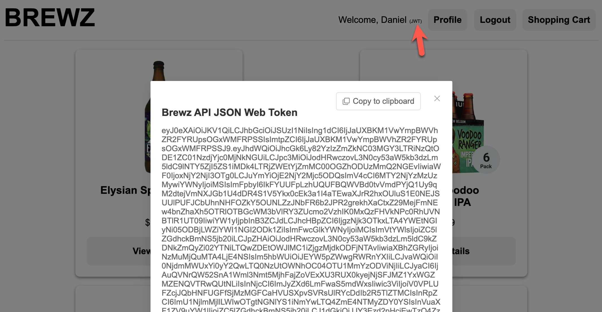
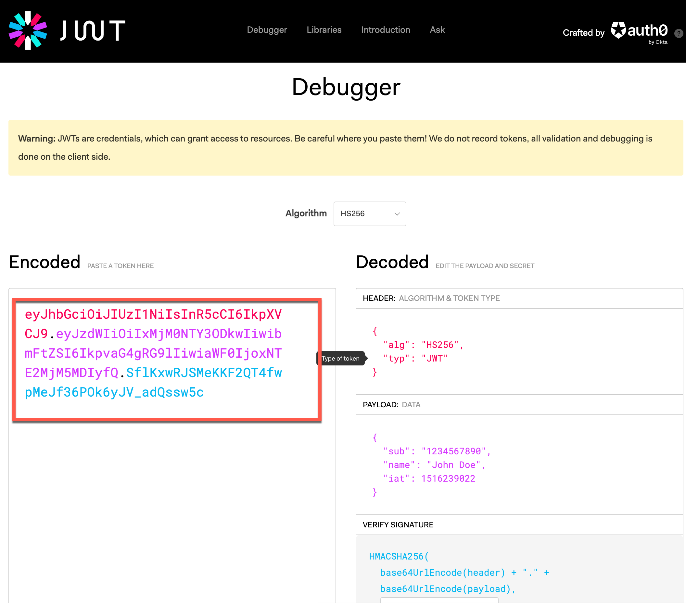
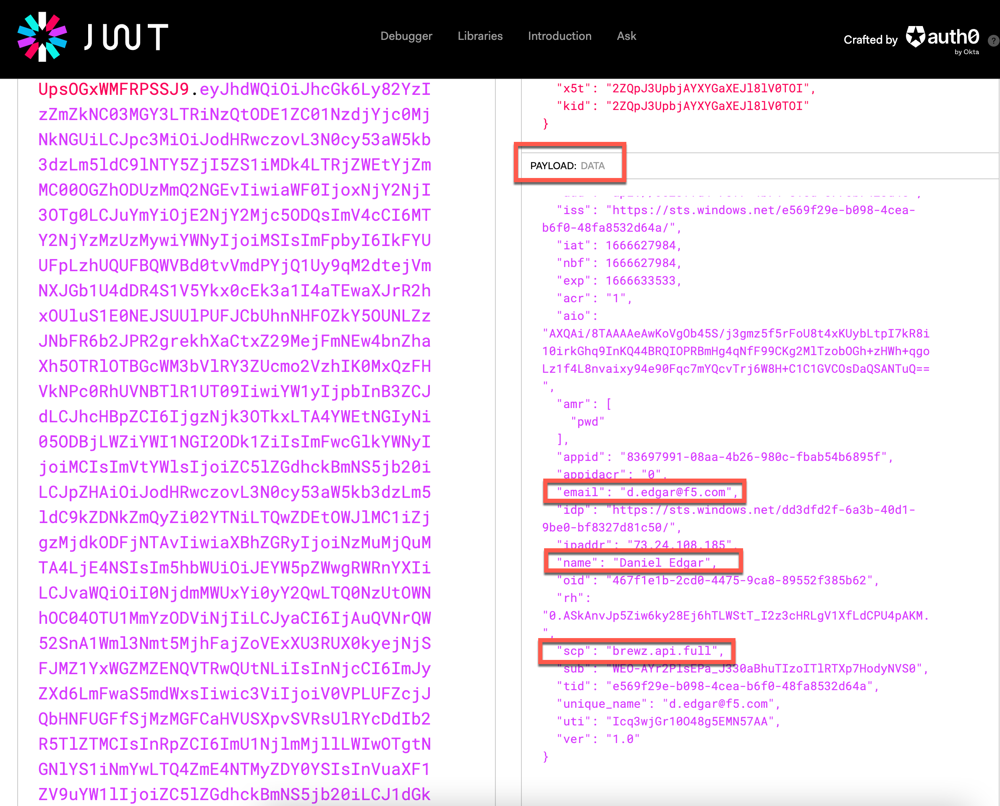

# The Brewz API JWT token

When authenticating with Azure in the Brewz SPA, application developers can request tokens that can be used for custom scopes that have been created for an application. For example, once Azure authenticates a user in the Brewz SPA, we have configured Azure to grant the user authorization to the Brewz APIs as well.

In the checkout view of the Brewz SPA, the developers have written code to request a JWT token from Azure to enable them to access the Brewz Checkout API.

1. If your browser's developer toolbar is still open, you may close it.

1. In the Brewz app, click the `(JWT)` link in the navigation header. It will request the JWT from Azure and display it:

    

1. Click the **Copy to clipboard** button.

1. In a new browser tab, navigate to [jwt.io](https://jwt.io).

1. Scroll down to the JWT Debugger on that page, and paste content box on the left:

    

1. When you paste in the content, the page will automatically decode your JWT. Note the 3 decoded portions of the JWT: the **header**, **payload** and the **signature**.

1. Look at the **payload** part of the decoded JWT token. Notice a `name` and `email` JSON property are present. These (and others) come from F5's Azure Active Directory, as our application has requested permissions to these basic user attributes at both app registration and login time.

    

    Also, note there is a JSON property named `scp`. This contains one or more scopes, which could be considered custom permission set names. These are defined and consumed by the Brewz API for which the client application (in our case, the Brewz SPA) has requested and received consent. In the Brewz API, all users have been granted to a scope named `brewz.api.full`, which we will reference later in this lab.

1. Still on the JWT debugger page, hover your pointer over the `"iat"` property. It will show a description depicting that this is the token issuance time. Next, hover over the numeric value to the right of it, and the Unix epoch time will be translated into your local time representing when the token was issued.

1. Look at the `"nbf"` and `"exp"` properties. These represent the "Not valid before time" as well as "expiration time", respectively.

> **Why this matters:** JWT validation is expected at minimum to reject any tokens that are outside of the usable time span of validity, as well as reject tokens whose contents have been altered in any way. What if we simply changed one of these timestamps in an effort to extend its validity? Since the JWT includes a cryptographic signature of the contents, any change to the payload would fail the JWT validation process.

## Next Steps

We have proven that the SPA is sending the token to the order method in the Checkout service. However, is this API enforcing the JWT authorization? We will find out in [Securing the Checkout API](securing-checkout.md).
