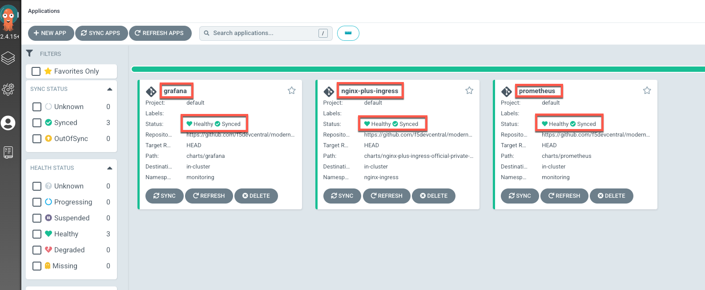
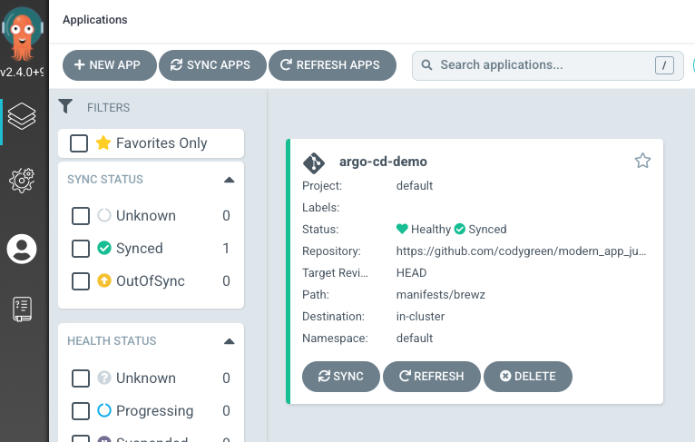

# Setup

## Deploy the Microservices Workshop UDF Blueprint

1. Open the [Microservices Workshop UDF Blueprint](https://udf.f5.com/b/792c428c-89f6-440e-b068-3d99a471fd9c#documentation) and deploy it in the region geographically closest to you. Start the deployment with the default suggested resource settings.

## Fork the workshop repository

1. To proceed with this scenario, you will need to fork the workshop repository to your GitHub account.  If this is your first time, then take a few minutes to review the [GitHub Docs on how to Fork a repo](https://docs.github.com/en/get-started/quickstart/fork-a-repo).

    You can complete this task through the [repository GitHub UI](https://github.com/f5devcentral/modern_app_jumpstart_workshop):
    

    or via the GitHub CLI:

    ```bash
    gh repo fork --clone f5devcentral/modern_app_jumpstart_workshop
    ```

    > **Note:** If you have completed earlier labs in this workshop, you have already forked this repository. If this is the case, you may skip this step.

## Clone your workshop repository to your laptop

Now that you have forked the workshop repository, you'll want to clone the repo to your local laptop.

1. Perform this via the git or GitHub CLI commands.

    > **Note:** Make sure to replace your_username with your GitHub username.

    > **Note:** If you have not [configured GitHub authentication](https://docs.github.com/en/authentication) with your local laptop, please stop and do that now.

    ```bash
    # via HTTPS
    git clone https://github.com/your_username/modern_app_jumpstart_workshop.git modern_app_jumpstart_workshop

    # via SSH
    git clone git@github.com:your_username/modern_app_jumpstart_workshop.git modern_app_jumpstart_workshop
    ```

    > **Note:** If you have completed earlier labs in this workshop, you will need to update your fork from the upstream repository. It is a destructive operation, but this can be accomplished by running the following commands on your local machine:

    ```bash

    cd <directory of your repository>

    git checkout main
    git pull upstream main
    git reset --hard upstream/main
    git push origin main --force
    ```

    > **Note:** If the **git pull upstream** command fails, you may need to add a new connection record to the modern_app_jumpstart_workshop repo. This can be accomplished by running the following command on your local machine:

    ```bash
    git remote add upstream https://github.com/f5devcentral/modern_app_jumpstart_workshop
    ```

## Run setup script

For this lab, you will start by running a script that installs everything that was completed in the previous labs of this workshop.

1. Use a utility of choice to view and copy the contents of the NGINX Trial JWT file for use in the next step.

1. SSH into the K3s server using the UDF *SSH* or *Web Shell* Access Methods and run the following commands:

    ```bash
    sudo su -

    export TRIAL_JWT=<paste contents of your JWT file>

    chmod +x /root/modern_app_jumpstart_workshop/docs/api-security/setup/setup.sh
    chmod +x /root/modern_app_jumpstart_workshop/setup/scripts/gen_kubeconfig.sh

    /root/modern_app_jumpstart_workshop/docs/api-security/setup/setup.sh
    ```

1. Wait for the script to finish running. It may take up to 5 more minutes for NGINX Ingress Controller, Prometheus and Grafana to be installed into k3s by ArgoCD.

## Login to ArgoCD

This lab uses [ArgoCD](https://argo-cd.readthedocs.io/en/stable/) for [GitOps](https://www.gitops.tech/) [Continuous Deployment](https://en.wikipedia.org/wiki/Continuous_deployment) of Kubernetes resources updated in a watched repository. If you are not familiar with ArgoCD, consider reviewing Labs [1](../scenario/README.md) and [2](../ingress/README.md) for an introduction to it and basic usage scenarios.

1. Run the following in the K3s server SSH session to obtain the ArgoCD password:

    ```bash
    kubectl -n argocd get secret argocd-initial-admin-secret -o jsonpath="{.data.password}" | base64 -d; echo
    ```

1. Use the ArgoCD UDF Access Method to access the ArgoCD UI and login with the `admin` user and the password you obtained in the previous step.

1. Once logged into ArgoCD, ensure that NGINX Ingress Controller, Prometheus and Grafana are healthy and synced as in the following image:

    

## Generate Local Kubeconfig

To access the K8s API, you will need to download a kubeconfig file from the K3s server in your UDF blueprint.

1. In your UDF deployment, click the Components tab then for the k3s system click the Access dropdown then the KUBECONFIG access method.

1. This will present a webpage with a link to download the `config-udf.yaml` file.

1. Once the file is downloaded, set your KUBECONFIG environment variable to point to this location. For more information, reference the [K8s docs](https://kubernetes.io/docs/concepts/configuration/organize-cluster-access-kubeconfig/#the-kubeconfig-environment-variable).

    ```bash
    ## Replace with your download location
    # Bash
    export KUBECONFIG=~/Downloads/config-udf.yaml

    # PowerShell
    $env:KUBECONFIG = 'C:\temp\config-udf.yaml'
    ```

    > **Note:** If your UDF deployment shuts down, the Kubeconfig file will will no longer be valid. This is because on startup, UDF changes the host name for the access method that kubectl uses to connect to the Kubernetes API. If this occurs, you will have to manually regenerate this file by running the following in SSH on the k3s server, then re-download the file as in the previous step:

    ```bash
    sudo /root/modern_app_jumpstart_workshop/setup/scripts/gen_kubeconfig.sh
    ```

1. Now, test that your settings are correct:

    ```bash
    kubectl get nodes
    ```

    > **Note:** If you run into an issue, run the following command to determine if the issue is your environment variable or your kubeconfig file.

    ```bash
    ## Replace with your download location
    kubectl --kubeconfig ~/Downloads/config-udf.yaml get nodes
    ```

    If the command succeeds, then check your environment variable.

## Install the Brewz app with ArgoCD

In this section, you will initially deploy the Brewz microservices app using ArgoCD.

### Copy the starter Brewz manifests

1. In your local repository, copy all the files from the `docs/api-security/setup/manifests/brewz` folder to the `manifests/brewz` folder. Overwrite any existing files if prompted. These manifests will effectively represent the final state of the Brewz app after completing earlier labs in this workshop.

  > **Note:** Use a file manager (such as OSX Finder or Windows Explorer) or a terminal to copy these files. If you use VS Code, it will not replace existing files; it will copy duplicate files appending a "copy" suffix to avoid name collisions.

1. Stage the changes from adding all the copied files, and commit to your local repository.

1. Push the changes to your remote repository.

### Update ArgoCD Application Manifest

You will need to update the Brewz ArgoCD manifest to match your environment.

> **Note:** If you have completed earlier labs in this microservices workshop, your subchart file may already reflect the changes in the following step. If this is the case, you may skip down to the [Deploy the manifest](#deploy-the-manifest) step.

1. Open the `manifests/brewz-subchart.yaml` file in your local lab repository.

1. Find the following variables and replace them with your information:

    | Variable        | Value                |
    |-----------------|----------------------|
    | \<GITHUB_USER\> | your github username |

    Your file should look similar to the example below:

    ```yaml
    apiVersion: argoproj.io/v1alpha1
    kind: Application
    metadata:
      name: brewz
      namespace: argocd
      finalizers:
        - resources-finalizer.argocd.argoproj.io
    spec:
      project: default
      source:
        path: manifests/brewz
        repoURL: https://github.com/codygreen/modern_app_jumpstart_workshop.git
        targetRevision: HEAD
      destination:
        namespace: default
        server: https://kubernetes.default.svc
      syncPolicy:
        automated:
          selfHeal: true
          prune: true
    ```

1. Save the file.

### Deploy the manifest

1. To deploy the Brewz ArgoCD application, run the following command:

    ```bash
    kubectl apply -f manifests/brewz-subchart.yaml
    ```

### Inspect the Brewz application

1. Open the ArgoCD UDF Access Method under the K3s server

1. Inspect the deployment state of the Brewz application to ensure that it is healthy and synced with your repository:

  

1. Use the **Brewz** UDF access method of the **k3s** component to explore the deployed app in your browser. Click the "BREWZ" title link to navigate to the main product catalog.

## Next Steps

Next, we will introduce the Brewz [checkout process](checkout-process.md).
