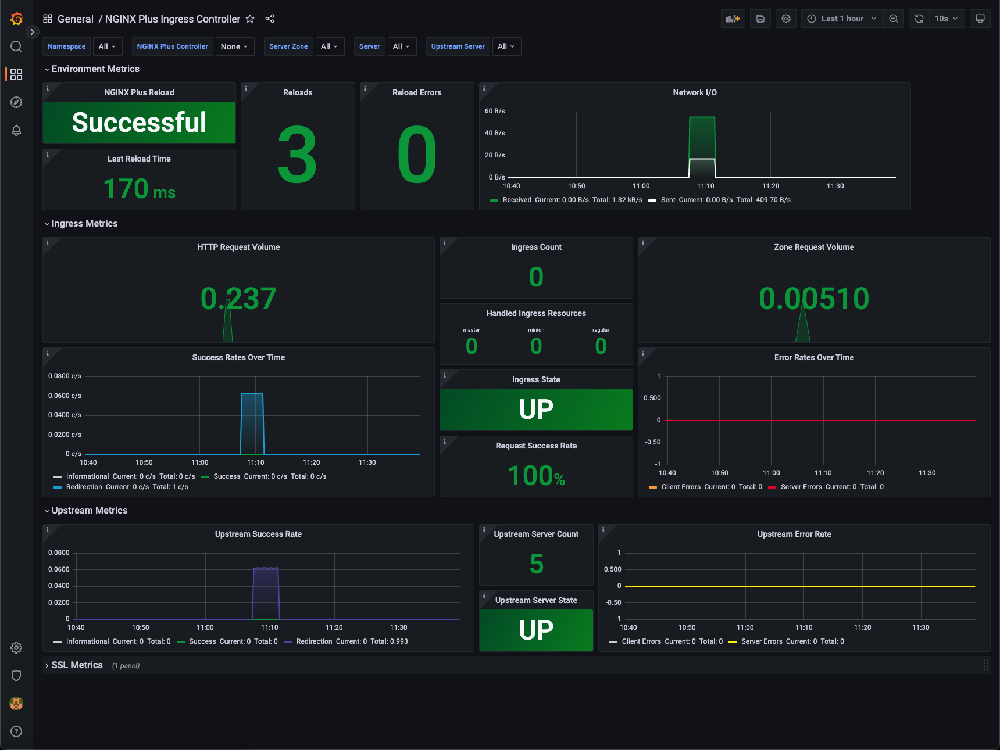
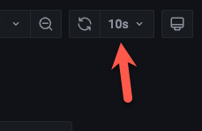
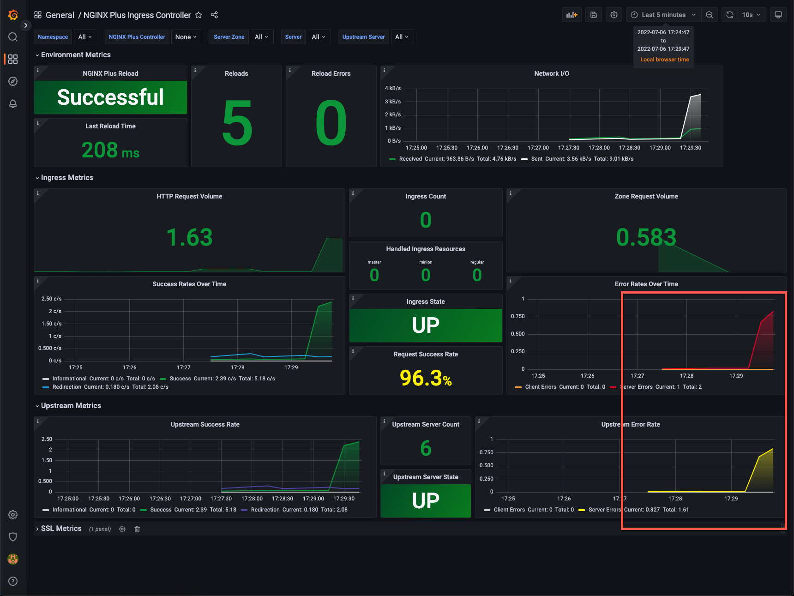

# Deployment Pattern Example: Canary

 The development team has been hard at work updating the Brewz application to expand its feature set. One of the changes requested is to the recommendation service. They want to change the algorithm that is used when suggesting additional products that the shopper can buy. They would ideally like to deploy this with no disruption in production. In this exercise, we will examine metrics that can be used to determine whether there are errors in the upstream services, as we roll out the new version of the recommendation service using the Canary deployment pattern.

## Examine NGINX Dashboard in Grafana

1. Click on the **Grafana** access method in the **k3s** component in the UDF deployment.

1. When presented for login credentials, enter `admin` as the username. To acquire the password, you must run the following command from your local machine to interrogate the K8s API for the secret containing the password:

    ```bash
    kubectl get secret --namespace monitoring grafana -o jsonpath="{.data.admin-password}" | base64 --decode ; echo
    ```

1. Select the **NGINX Plus Ingress Controller** dashboard from the Grafana **Dashboards** menu. The dashboard should appear:

    

1. By default, this dashboard does not automatically refresh. Click the refresh icon in the upper right of the screen and set the refresh value to 10 seconds.

    

    > Note that there are various filters you can use to examine a subset of the data. By default, the dashboard will consume NGINX Plus Prometheus metrics from all namespaces, so you may wish to filter on the `default` namespace. Additionally, you may also filter data that appears in the **Upstream Metrics** portion of the dashboard to specific upstreams by use of the **Upstream Server** menu.

1. Open the **Brewz** UDF access method of the **k3s** component, and exercise various functions of the application.

1. Return to the Grafana dashboard. You should start to see **Ingress Metrics** such as **Success Rates Over Time** and **Upstream Success Rate** charts start to trend upward. This is a good indication that the application is operating correctly.

## Deploy the Recommendations v2 Service

The development team has developed and created a container image of the recommendations service in the registry. We will deploy this new version of the service alongside the existing version, but at first only send a portion of incoming requests to this new version of the service. We will monitor the health of this new service's upstream in the Grafana dashboard, and will either continue the rollout, or back out the change if errors occur. Let's do it.

> **Note:** You will use your forked version of the **primary** repository for this portion of the lab.

1. In VSCode, append the following new `Deployment` and `Service` resources to the `manifests/brewz/app.yaml` file, and save it:

    ```yaml

    ---
    apiVersion: apps/v1
    kind: Deployment
    metadata:
      name: recommendations-v2
    spec:
      replicas: 1
      selector:
        matchLabels:
          app: recommendations-v2
      template:
        metadata:
          labels:
            app: recommendations-v2
        spec:
          containers:
            - name: recommendations-v2
              image: ghcr.io/f5devcentral/spa-demo-app-recommendations:sha-8123c6f
              ports:
                - containerPort: 8001
    ---
    apiVersion: v1
    kind: Service
    metadata:
      name: recommendations-v2
    spec:
      ports:
        - port: 8001
          targetPort: 8001
          protocol: TCP
          name: http
      selector:
        app: recommendations-v2

    ```

1. Append the following yaml snippet to the list of `upstreams` in the `manifests/brewz/virtual-server.yaml` file:

    ```yaml
        - name: recommendations-v2
          service: recommendations-v2
          port: 8001
    ```

1. Modify the existing `/api/recommendations` path in the `routes` section of the file so it looks like this and save it - ensure you remove the existing action:

    ```yaml
        - path: /api/recommendations
          splits:
            - weight: 90
              action:
                proxy:
                  upstream: recommendations
                  rewritePath: /api/recommendations
            - weight: 10
              action:
                proxy:
                  upstream: recommendations-v2
                  rewritePath: /api/recommendations
    ```

    > **Note:** The result of these changes to the file will configure NGINX Ingress Controller to route roughly 90% of requests to the `/api/recommendations` path to the `recommendations` upstream, and the remaining 10% to the `recommendations-v2` upstream.

1. Commit the `manifests/brewz/virtual-server.yaml` and `manifests/brewz/app.yaml` files to your local repository, then push them to your remote repository. ArgoCD will pick up the most recent changes, and deploy them for you.

    Once the configuration is deployed, NGINX Ingress Controller will reload NGINX, and the **Reloads** metric on the Grafana dashboard should increment.

1. Use the **Hey** utility on your laptop to request the **recommendations** service directly as if the Brewz SPA application was doing so:

    ```bash
    BREWZ_URL=<Your Brewz UDF access method url>
    hey -n 2000 -c 4 -q 10 $BREWZ_URL/api/recommendations
    ```

1. As this is running, monitor the success and error rates in the Grafana dashboard. What do you see? It looks like an upstream is reporting server errors. The **recommendations-v2** service (in association to its upstream) is reporting the errors. Also, when the **Hey** utility completes running, you should notice roughly 10% of the requests returned 500 errors in its summary.

    

## Rollback the Deployment

The DevOps and the application owners aren't willing to allow this error condition to continue, so it is decided to route all traffic back to the older version of the recommendations service so that the team can investigate offline without affecting customers. While Kubernetes and ArgoCD both have rollback capabilities, we have made the decision to effectively revert the change so that all traffic is once again routed to the older version of the recommendations service.

1. In VSCode, open a terminal and run the following commands to revert your previous git commit:

    ```bash
    # Find your last commit ID
    git log -1

    # revert your commit
    git revert your_commit_id

    # Update origin 
    git push origin
    ```

1. ArgoCD will pick up the most recent changes, and deploy them for you. Check the brewz `VirtualServer` resource under the `brewz` application to check that the revert was successful.

1. Once the revert is successful, use the **Hey** utility on your laptop to request the **recommendations** service directly as if the Brewz SPA application was doing so:

    ```bash
    BREWZ_URL=<Your Brewz UDF access method url>
    hey -n 2000 -c 4 -q 10 $BREWZ_URL/api/recommendations
    ```

1. As this is running, monitor the success and error rates in the Grafana dashboard. What do you see? The upstream error rates should return to zero and no longer reporting server errors.

## Next Steps

Next, you will [add API protection with NGINX App Protect WAF](waf.md).
