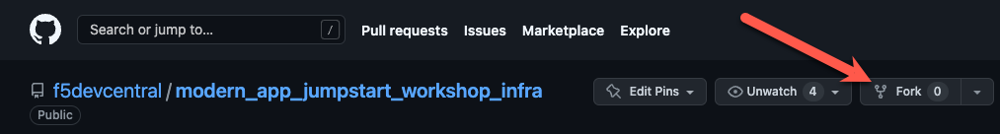

# Setup

For this lab, you will start with a clean environment and build out your K3s environment.

## Uninstall K3s in UDF

1. SSH into the K3s server using the UDF *SSH* or *Web Shell* Access Methods and run the following commands:

    ```bash
    sudo su -
    /usr/local/bin/k3s-uninstall.sh
    ```

1. The blueprint used in this workshop has automation that will redeploy base manifests on startup. Since the base manifests were for earlier labs, we need to prevent this from occurring. You need to disable the `udf-setup` service:

    ```bash
    systemctl disable udf-setup
    ```

## Install K3s in UDF

For this lab we will leverage the Rancher K3s Kubernetes distribution.  Since we plan to use NGINX Plus as our ingress controller we will also tell K3s not to install Traefik as the default ingress.

1. Run the following command on the K3s server:

    ```bash
    curl -sfL https://get.k3s.io | INSTALL_K3S_EXEC="--disable traefik --egress-selector-mode=disabled --bind-address 10.1.1.5 --kube-apiserver-arg=feature-gates=LegacyServiceAccountTokenNoAutoGeneration=false" INSTALL_K3S_VERSION=v1.25.12+k3s1 sh -s -
    ```

    > **Note:** The default behavior starting with Kubernetes version 1.24 is **not** to auto generate secret tokens when creating service accounts. The above installation includes the option to disable this change in behavior. More information about this change can be found [here](https://github.com/kubernetes/kubernetes/blob/master/CHANGELOG/CHANGELOG-1.24.md#urgent-upgrade-notes:~:text=The%20LegacyServiceAccountTokenNoAutoGeneration%20feature%20gate%20is%20beta%2C%20and%20enabled%20by%20default.%20When,controller%20to%20populate%20with%20a%20service%20account%20token%20by%20following%20this).

## Generate Service Account

To provide remote Access to the K8s API, the best practice would be to generate a dedicated K8s Service Account.

1. Run the following commands on the K3s server:

    ```bash
    kubectl -n kube-system create serviceaccount udf-sa
    kubectl create clusterrolebinding udf-sa-cluster-admin --clusterrole=cluster-admin --serviceaccount=kube-system:udf-sa
    TOKENNAME=`kubectl -n kube-system get serviceaccount/udf-sa -o jsonpath='{.secrets[0].name}'`
    echo $TOKENNAME
    TOKEN=`kubectl -n kube-system get secret $TOKENNAME -o jsonpath='{.data.token}' | base64 --decode`
    echo $TOKEN
    ```

## Generate Local Kubeconfig

Now that we have K3s up and running and a dedicated service account for UDF we need to build a kubeconfig file so *kubectl* on your laptop knows how to access our cluster.

> **Note:** The `kubectl config` command will produce warnings about invalid configuration - this can be ignored since you are building the configuration.

1. Run the following commands on the K3s server:

    ```bash
    NEWCFG=/etc/rancher/k3s/config-udf.yaml

    # Get the UDF Access Method
    HOST=`curl -s metadata.udf/deployment | jq '.deployment.components[] | select(.name == "k3s") | .accessMethods.https[] | select(.label == "K3s API") | .host' -r`

    # Get the UDF Access Method's CA
    CA=`openssl s_client -connect $HOST:443 2>&1 </dev/null | sed -ne '/-----BEGIN CERTIFICATE-----/,/-----END CERTIFICATE-----/p'|base64 -w 0`

    # Ensure the Kubernetes API is up
    while ! kubectl get po
    do
        echo waiting for kube api to be up...
        sleep 10
    done

    # Add the UDF K8s API 
    kubectl --kubeconfig=$NEWCFG config set-cluster udf  --server=https://$HOST:443 
    kubectl --kubeconfig=$NEWCFG config set clusters.udf.certificate-authority-data $CA

    # set the token
    TOKENNAME=`kubectl -n kube-system get serviceaccount/udf-sa -o jsonpath='{.secrets[0].name}'`
    TOKEN=`kubectl -n kube-system get secret $TOKENNAME -o jsonpath='{.data.token}' | base64 --decode`
    kubectl --kubeconfig=$NEWCFG config set-credentials udf-sa --token=$TOKEN

    # Set context
    kubectl --kubeconfig=$NEWCFG config set-context udf --cluster=udf --namespace=default --user=udf-sa

    # Set current context
    kubectl --kubeconfig=$NEWCFG config set current-context udf

    # Display kubeconfig file
    cat $NEWCFG
    ```

1. Copy the output from the kubeconfig file and save it to a file on your laptop, for example in `<your downloads folder>/config-udf.yaml`.

1. Set the `KUBECONFIG` environment variable to reference this new kubeconfig file such as in the example commands below:

    ```bash
    export KUBECONFIG=~/Downloads/config-udf.yaml
    ```

1. Use kubectl to test your new configuration:

    ```bash
    kubectl get nodes
    ```

    You should see the k3s node:

    ```shell
    NAME   STATUS   ROLES                  AGE   VERSION
    k3s    Ready    control-plane,master   6m    v1.25.12+k3s1
    ```

# Fork Infrastructure Repository

When practicing GitOps with ArgoCD, it is a [good practice](https://argo-cd.readthedocs.io/en/stable/user-guide/best_practices/) to separate your application code from your infrastructure configuration into separate repositories. This will ensure that changes to either may occur in isolation without triggering a large-scale deployment.

1. Fork this secondary repository to your own GitHub account as you did earlier.

    You can complete this task through the [repository GitHub UI](https://github.com/f5devcentral/modern_app_jumpstart_workshop_infra):
    

    or via the GitHub CLI:

    ```bash
    gh repo fork --clone f5devcentral/modern_app_jumpstart_workshop_infra
    ```

## Clone your workshop infrastructure repository to your laptop

Now that you have forked the workshop infrastructure repository, you'll want to clone the repo to your local laptop. You can do this via the git or GitHub CLI commands.

> **Note:** Make sure to replace your_username with your GitHub username.

> **Note:** If you have not [configured GitHub authentication](https://docs.github.com/en/authentication) with your local laptop, please stop and do that now.

1. Clone the repo:

    ```bash
    # via HTTPS
    git clone https://github.com/your_username/modern_app_jumpstart_workshop_infra.git modern_app_jumpstart_workshop_infra

    # via SSH
    git clone git@github.com:your_username/modern_app_jumpstart_workshop_infra.git modern_app_jumpstart_workshop_infra
    ```

    > **Note:** For the remainder of this lab, we will refer to this repository as **"infra"**.

## Next Steps

Next, we will [install ArgoCD](argocd.md)
