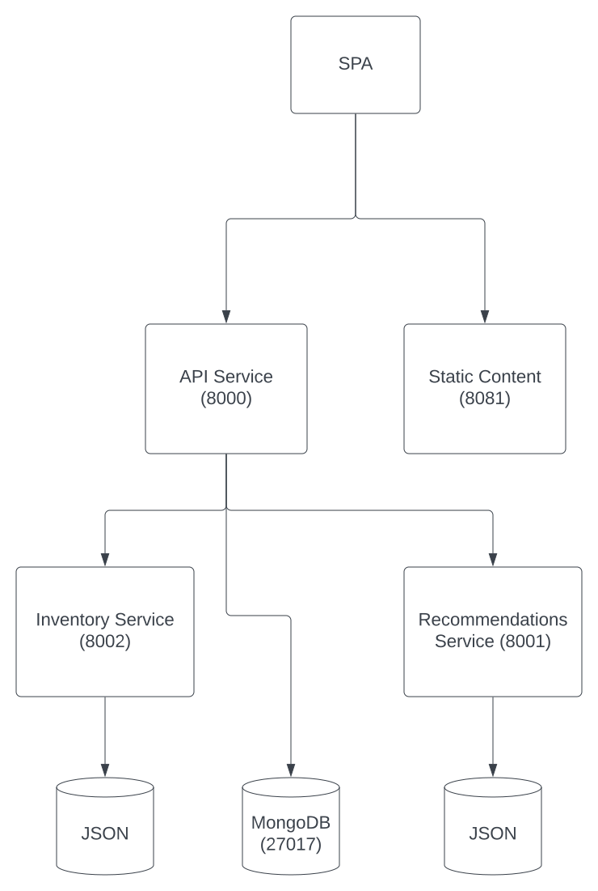

# Lab 1: Monolith to Microservices Scenario

In this portion of the workshop we will walk through a common scenario that a developer might take as they transition their application from a monolith to microservices.

## Brewz Company Overview

As with many retail companies, the Brewz company had to quickly accelerate their digital transformation during the COVID-19 pandemic in order to adapt and stay in business in light of new circumstances.

To do so, the Brewz company determined it needed an online e-commerce presence where customers could shop for and purchase many of their delicious brews. Fortunately, the Brewz company already had an internal web application they used to track inventory and product information. The plan was to expose this application to the internet after developing an accompanying shopping cart and purchasing system.  

After a few months of developing this, the Brewz company exposed this to their customers online via a cloud services provider. Initially, all seemed to work well, but after a while when their popularity grew, customers started to complain about a very poor (slow) experience in their web store. What could the brew company do? Initial investigation led to the realization that most of the performance issues were related to the product catalog portion of the application. Bots, search engines were continuously scanning the product catalog (which could be a good thing in terms of promotion) but were unfortunately creating poor availability for actual customers. This previously internal application was developed long ago as a large monolith. It required a very large virtual machine to run on and was cost prohibitive to stand up another instance in their cloud provider to keep up with demand. Additionally, the Brewz company wanted to make regular updates to this application but was plagued with large outages just to make seemingly simple updates to their application. There had to be a better way...

## The Monolithic Brewz Application

The existing Brewz application runs on a single virtual machine, and is deployed as a unit. The application is a VueJS Single Page App (SPA) written in Javascript. The SPA application makes calls to a REST API. There is no application proxy (such as NGINX) used in the current deployment. The following diagram represents the current state of the Brewz application:

It should be clear that this application is highly dependent on its REST API, so speed and reliability of this API are very important.

## Lab 1 Missions

**Mission 1:**

- Break monolithic VM application into separate "microservices" to enable per-component scalability.
- Host application in Kubernetes for service automation and orchestration.

  - [Setup](setup.md)

**Mission 2:**

- Implement an API gateway to rate limit visitors that may be abusing the application

  - [Rate-limit](rate-limit.md)

**Mission 3:**

- Achieve granular scalability and non-disruptive application deployments

  - [Refactor-to-microservices](refactor.md)

**Mission 4:**

- Introduce Deployment Patterns

  - [Example deployment pattern: A/B Testing](ab-testing.md)

**Mission 5:**

- Acquire application performance visibility

  - [Grafana-dashboard](grafana-dashboard.md)
