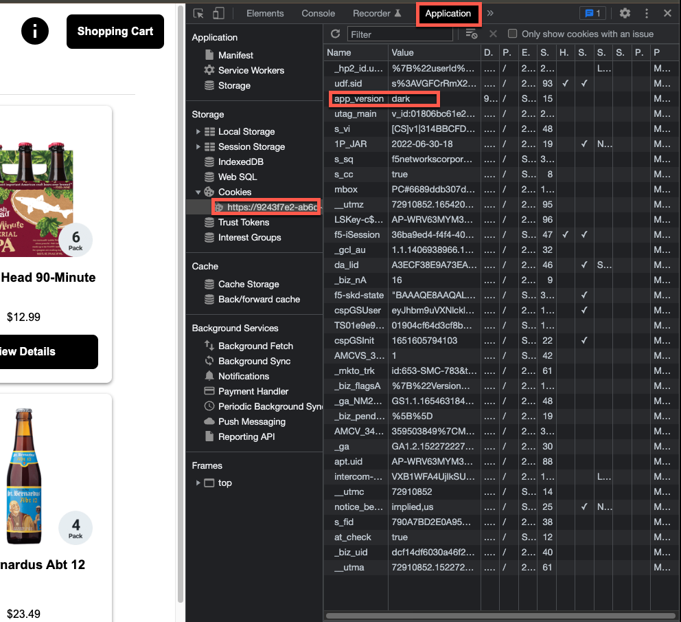

# Deployment Pattern Example: A/B Testing

Unsurprisingly, marketing has been interested in how to improve the look and feel the Brewz application in an effort to drive additional site visits and ultimately increase revenue. They have worked with the frontend web designers on a more modern look and feel for the application. However, at first they are only interested in presenting this new experience to key shoppers, based on a custom-crafted cookie. The rest of the users will continue to see the existing design. However, implementing this temporary change in application code would be relatively expensive, and accrues technical debt as this conditional code would eventually have to be removed.

NGINX Ingress Controller's traffic splitting features are an ideal fit for this use case, as the conditional logic for this testing period becomes a matter of configuration rather than code. In addition to this particular scenario - called "A/B Testing", NGINX Ingress Controller also supports other deployment patters such as Canary, Blue-Green, and Debug routing.

The development team has already been hard at work updating the Brewz SPA app with the new user experience, and has published a version of it to the container registry. Fortunately due to the refactoring we performed earlier in the lab, the development team no longer has to deploy the entire application in order to make front-end changes, as when they had to when the app was monolithic in nature.

## Update the Brewz Deployment and Virtual Server

We need to deploy the new variant of the SPA application, so we can conditionally route traffic to it.

1. In your fork of the lab repository, append the following yaml snippet to the `manifests/brewz/app.yaml` file and save it:

    ```yaml
    ---
    apiVersion: apps/v1
    kind: Deployment
    metadata:
      name: spa-dark
    spec:
      replicas: 1
      selector:
        matchLabels:
          app: spa-dark
      template:
        metadata:
          labels:
            app: spa-dark
        spec:
          containers:
            - name: spa-dark
              image: ghcr.io/f5devcentral/spa-demo-app-spa-dark:sha-ec8dec7
              ports:
                - containerPort: 8080
    ---
    apiVersion: v1
    kind: Service
    metadata:
      name: spa-dark
    spec:
      ports:
        - port: 8080
          targetPort: 8080
          protocol: TCP
          name: http
      selector:
        app: spa-dark

    ```

    > **Note:** In addition to a new `Deployment` resource, we are introducing a new `Service` resource so we can route traffic to the new SPA application variant.

1. Append the following yaml snippet to the list of `upstreams` in the `manifests/brewz/virtual-server.yaml` file:

    ```yaml
        - name: spa-dark
          service: spa-dark
          port: 8080
    ```

1. Modify the existing `/` path in the `routes` section of the file so it looks like this and save it:

    ```yaml
        - path: /
          matches:
            - conditions:
              - cookie: "app_version"
                value: "dark"
              action:
                pass: spa-dark
          action:
            pass: spa
    ```

    > **Note:** We are only updating a specific portion of the `routes` section.

    > **Note:** The result of these changes to the file will configure NGINX Ingress Controller to conditionally route all requests to the `/` location to the `spa-dark` upstream if a cookie named `app_version` with a value of `dark` is present in the request. Otherwise, the requests will be routed to the `spa` upstream.

1. Commit the `manifests/brewz/virtual-server.yaml` and `manifests/brewz/app.yaml` files to your local repository, then push them to your remote repository. ArgoCD will pick up the most recent changes, and deploy them for you.

1. Open the **Brewz** UDF access method on the **k3s** component. Note that the application looks the same as it has been in previous labs.

1. Open the **Brewz** UDF access method in a new tab, and open the developer tools.

1. Manually add the `app_version` cookie with a value of `dark` to the developer tools window. Methods vary depending on which browser you are using, but if using Chrome click on the Application tab, and expand the cookies section for the UDF url you are accessing. Add a new cookie by double clicking the table after the existing cookie entries. Enter `app_version` in the first column, hit tab and enter `dark` in the next column. The rest of the defaults will suffice. When complete, it should look similar to this screenshot:

    

1. Refresh the tab in Chrome. You should see a different design for the Brewz application, notably that the background and font colors are different.

## Next Steps

Acquire application performance visibility with [Grafana](grafana-dashboard.md).
