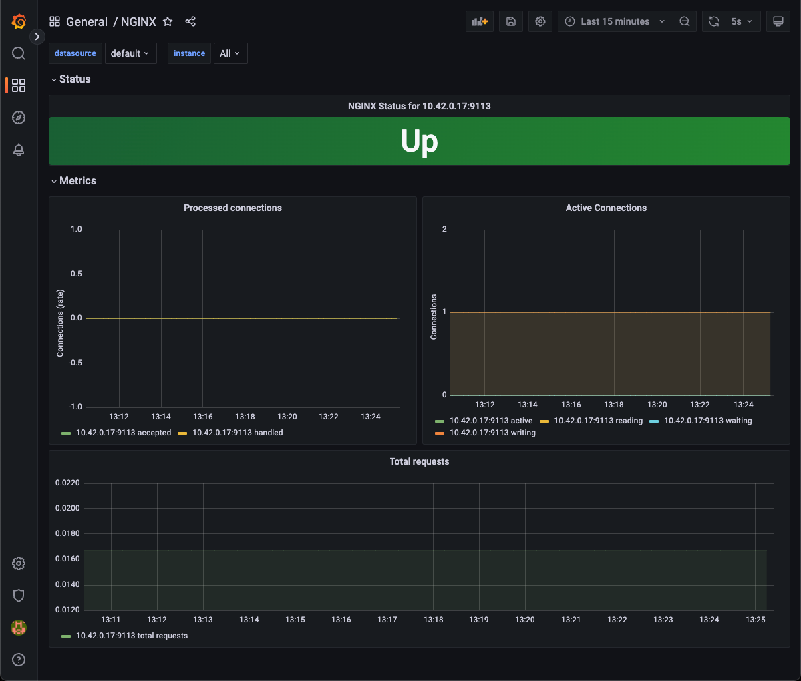

# Install the Grafana dashboard for NGINX

The NGINX Ingress Controller provides a Grafana dashboard to provide analytical data related to the performance and behavior of the controller's underlying NGINX metrics. The NGINX Ingress Controller has been installed with support for providing these metrics in the Prometheus format, and we will leverage Grafana to consume these metrics, and provide a visual representation of this data.

A list of Prometheus metrics available for querying in the dashboard are available in the [NGINX Prometheus Exporter repo](https://github.com/nginxinc/nginx-prometheus-exporter#metrics-for-nginx-oss). The only difference is that the exporter variables need to be prefixed with `nginx_ingress_` when used in an NGINX Ingress Controller context. Due to this, we cannot use the dashboard provided in the above repo; we will need to use the dashboard in the repo for this lab.

Grafana has been pre-installed using Helm based on [this guidance](https://github.com/grafana/helm-charts), and its service has been exposed in the k8s cluster via NodePort, and accessible in a UDF access method.

1. Click on the **Grafana** access method in the **k3s** component in the UDF deployment.

1. When presented for login credentials, enter `admin` as the username. To acquire the password, you must from your local machine interrogate k8s for the secret containing the password:

    ```bash
    kubectl get secret --namespace monitoring grafana -o jsonpath="{.data.admin-password}" | base64 --decode ; echo
    ```

1. Once logged in, click the **Data sources** item from the **Configuration** menu in the lower left. Click the **Add data source** button. Select **Prometheus**.

1. Set the **URL** field to `http://prometheus-server`

1. Click the **Save & test** button.

1. Click the **Dashboards** menu in the upper left. Click the **Import** button.

1. Click the **Upload JSON file** button and select the `grafana/dashboard.json` file from the lab repo you forked.

1. Select the **Prometheus** data source you created above and click **Import**.

1. The dashboard will appear.

    

    > **Note:** In this lab environment, we have deployed a single NGINX Ingress Controller instance. If you had additional instances deployed, you can filter the instance label just below the dashboard title (top left corner). This allows you to filter metrics per instance. By default, all instances are selected.

1. By default, the dashboard is set to refresh every 5 seconds. Using Hey (as earlier in the lab), generate traffic to the Brewz application and watch the effect on the charts in the dashboard:

    ```bash
    BREWZ_URL=<Your Brewz UDF access method url>
    hey -n 200 -c 10 $BREWZ_URL/api/products
    ```

    

## Next Steps

Monolith to Microservices Scenario lab complete. Return to [workshop index](../README.md).
