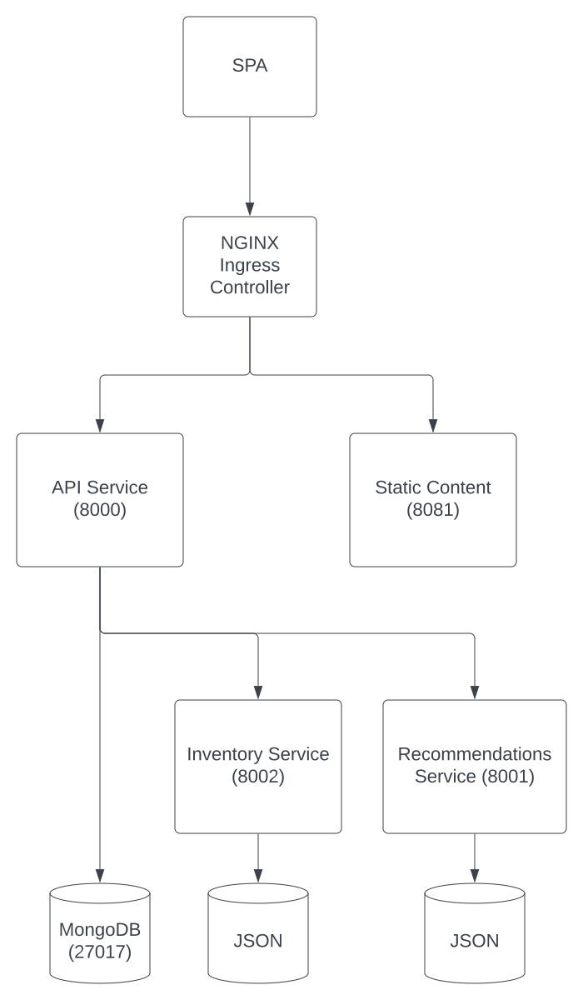

# Refactor to Microservices

While we are now successfully running the Brewz application in Kubernetes, there are some architectural improvements that can be made in order to promote efficiency, scalability, and enable the reduction risk through smaller units of deployment.

Re-examine the current state of the Brewz deployment architecture:



Problem statement: It has been noted that at times the `inventory` and `recommendations` services have been an extremely popular feature of the Brewz site. So much that heavy usage of these services have cascaded into a poor experience for users of the entire site.

The way the site is currently architected likely would require scaling both the `api` service as well as the `inventory` and `recommendations` services in order to meet demand. Upon examination of the [api service code](https://github.com/f5devcentral/spa-demo-app/blob/19fd503004a8e3ab5a01eb7eddcac56da165f1c8/api/src/server.js#L121), your developers notice that the api service doesn't provide any real value when calls are made through it to these upstream services. The api service is essentially "passing through" the requests. It would be more efficient and a reduction of code and design complexity to break this simple dependency. We will use NGINX Ingress Controller to route these requests to the originating services themselves so we can update and scale them independently. When our work is complete, this will be the new representation of the deployment architecture:


Let's make it happen...

## Update manifests to add additional microservice routes

The goal of this refactoring is to make changes to the deployment architecture without necessitating changes to the services' code. While this may not always be the case, we are in luck: the changes we need to make are simply to make HTTP path-based routing decisions to override where the existing api calls are being serviced. This can be accomplish by simply updating the `virtual-server.yaml` manifest's **Virtual Server Route** configuration.

1. In VSCode, edit your forked repo's copy of the `virtual-server.yaml` to make it look like the following:

    ```yaml
    ---
    apiVersion: k8s.nginx.org/v1
    kind: VirtualServer
    metadata:
      name: brewz
    spec:
      host: brewz.f5demo.com
      upstreams:
        - name: spa
          service: spa
          port: 8080
        - name: api
          service: api
          port: 8000
        - name: inventory
          service: inventory
          port: 8002
        - name: recommendations
          service: recommendations
          port: 8001
      routes:
        - path: /
          action:
            pass: spa
        - path: /api
          policies:
            - name: rate-limit-policy
          action:
            pass: api
        - path: /api/inventory
          action:
            proxy:
              upstream: inventory
              rewritePath: /api/inventory
        - path: /api/recommendations
          action:
            proxy:
              upstream: recommendations
              rewritePath: /api/recommendations
        - path: /images
          action:
            proxy:
              upstream: api
              rewritePath: /images

    ```

    Note that we have:
      * Added upstream definitions to the `inventory` and `recommendations` services.
      * Added more specific paths so that calls to `/api/inventory` and `/api/recommendations` are being routed directly to the authoritative services, and ultimately the pods that contain them.

1. Save and commit the `virtual-server.yaml` file to the local repository, and push the changes to your remote GitHub repository.

1. Open the ArgoCD UI to ensure that the changes to the Virtual Server have been deployed successfully.

1. Use the **Brewz** UDF access method to explore the deployed app in your browser and ensure it still functions correctly.

## Scale the services independently

Now that the services have been decoupled, we will independently scale the `inventory` service without being concerned with the need to scale the `api` service as well.

1. In VSCode, edit your forked repo's copy of the `app.yaml` and change the number of replicas of the inventory service to `3` (at line 157). When complete, the inventory Deployment should look similar to the following:

    ```yaml
    ...

    apiVersion: apps/v1
    kind: Deployment
    metadata:
      name: inventory
    spec:
      replicas: 3
      selector:
        matchLabels:
          app: inventory
      template:
        metadata:
          labels:
            app: inventory
        spec:
          containers:
            - name: inventory
              image: ghcr.io/f5devcentral/spa-demo-app-inventory:<tag name varies>
              ports:
                - containerPort: 8002

    ...
    ```

1. Save and commit the `app.yaml` file to the local repository, and push the changes to your remote GitHub repository.

1. Open the ArgoCD UI to ensure that the changes to the Virtual Server have been deployed successfully.

    In the **brewz** app details, note the number of replicas for the `inventory` pod have now been scaled to 3. You can also examine this by running the following command locally:

    ```bash
    kubectl get pods
    ```

    How many pods for the `inventory` service do you see?

## Remove unused code

While out of scope for this lab, it would behoove the developers of the Brewz site to remove the now-unnecessary lines of code in the `api` service that previously performed these simple passthrough service calls. Once the code has been removed, only the `api` service's underlying pods need to be updated as opposed to the entire deployment, reducing the potential "blast radius" of changes. We'll touch on some common, non-disruptive deployment techniques later in this lab.

## Next Steps

Introduce Deployment Patterns: [Example deployment pattern: A/B Testing](ab-testing.md)
