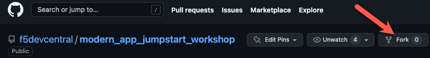
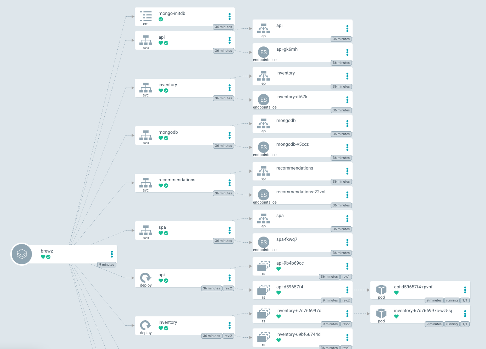

# Setup

To start the monolith to microservices scenario you will first need to ensure the following items are installed on your laptop:

- [Visual Studio Code](https://code.visualstudio.com/)
- [git](https://git-scm.com/downloads)
- [kubectl](https://kubernetes.io/docs/tasks/tools/)
- [GitHub CLI - optional](https://cli.github.com/)

## Deploy the Microservices Workshop UDF Blueprint

1. Open the [Microservices Workshop UDF Blueprint](https://udf.f5.com/b/792c428c-89f6-440e-b068-3d99a471fd9c#documentation) and deploy it in the region geographically closest to you. Start the deployment with the default suggested resource settings.

## Fork the workshop repository

1. To proceed with this scenario, you will need to fork the workshop repository to your GitHub account.  If this is your first time, then take a few minutes to review the [GitHub Docs on how to Fork a repo](https://docs.github.com/en/get-started/quickstart/fork-a-repo).

    You can complete this task through the [repository GitHub UI](https://github.com/f5devcentral/modern_app_jumpstart_workshop):
    

    or via the GitHub CLI:

    ```bash
    gh repo fork --clone f5devcentral/modern_app_jumpstart_workshop
    ```

## Clone your workshop repository to your laptop

Now that you have forked the workshop repository, you'll want to clone the repo to your local laptop.  

1. Perform this via the git or GitHub CLI commands.

    > **Note:** Make sure to replace your_username with your GitHub username.

    > **Note:** If you have not [configured GitHub authentication](https://docs.github.com/en/authentication) with your local laptop, please stop and do that now.

    ```bash
    # via HTTPS
    git clone https://github.com/your_username/modern_app_jumpstart_workshop.git modern_app_jumpstart_workshop

    # via SSH
    git clone git@github.com:your_username/modern_app_jumpstart_workshop.git modern_app_jumpstart_workshop
    ```

## Generate Local Kubeconfig

To access the K8s API, you will need to download a kubeconfig file from the K3s server in your UDF blueprint.

1. In your UDF deployment, click the Components tab then for the k3s system click the Access dropdown then the KUBECONFIG access method.

1. This will present a webpage with a link to download the `config-udf.yaml` file.

1. Once the file is downloaded, set your KUBECONFIG environment variable to point to this location. For more information, reference the [K8s docs](https://kubernetes.io/docs/concepts/configuration/organize-cluster-access-kubeconfig/#the-kubeconfig-environment-variable).

    ```bash
    ## Replace with your download location
    # Bash
    export KUBECONFIG=~/Downloads/config-udf.yaml

    # PowerShell
    $env:KUBECONFIG = 'C:\temp\config-udf.yaml'
    ```

1. Now, test that your settings are correct:

    ```bash
    kubectl get nodes
    ```

    > **Note:** If you run into an issue, run the following command to determine if the issue is your environment variable or your kubeconfig file.

    ```bash
    ## Replace with your download location
    kubectl --kubeconfig ~/Downloads/config-udf.yaml get nodes
    ```

    If the command succeeds, then check your environment variable.

## Manually deploy the Brewz application using manifests

Now that we have connectivity to the Kubernetes API, we will deploy the Brewz app into the k3s Kubernetes cluster. The manifest files describing the database, the containers to be deployed and proxy ingress configuration has been provided for you by the Brewz development team as a result of their initial investment in breaking down the monolithic application into separate containers. The manifest files provided will create a series of resources in Kubernetes that represent the application deployment, such as ConfigMaps, Deployments, Services, and a Virtual Server.

Once deployed into Kubernetes, the Brewz deployment will look like this:


> **Note:** The NGINX Ingress Controller has been introduced as a proxy to the APIs, serving as an **API Gateway**.

1. On your local machine, open a terminal to the directory that you cloned your repository into and run the following commands:

    ```bash
    kubectl apply -f manifests/brewz/mongo-init.yaml
    kubectl apply -f manifests/brewz/app.yaml
    kubectl apply -f manifests/brewz/virtual-server.yaml
    ```

1. Use the **Brewz** UDF access method of the **k3s** component to explore the deployed app in your browser. Click the "BREWZ" title link to navigate to the main product catalog.

## GitOps with ArgoCD

For the remainder of this lab, we will no longer be manually deploying applications with kubectl. We will be practicing [GitOps](https://www.gitops.tech/) for [Continuous Deployment](https://en.wikipedia.org/wiki/Continuous_deployment) of our applications. [ArgoCD](https://argo-cd.readthedocs.io/en/stable/) is the tool we will be using to watch your forked repository for changes, and automatically deploy updated resources to Kubernetes for you. In this lab, ArgoCD is already installed for you in your Kubernetes cluster.

### Obtain the ArgoCD password

1. To leverage the ArgoCD UI, you will need to obtain the password created at install - save this for later use.

    ```bash
    kubectl -n argocd get secret argocd-initial-admin-secret -o jsonpath="{.data.password}" | base64 -d; echo
    ```

1. Now open the **ArgoCD** UDF access method of the **k3s** component, and login with `admin` and the password obtained from the previous step.

1. Once logged in, click the **+ NEW APP** button. Enter the following values:

    | **Name**               | **Value**                                         |
    |------------------------|---------------------------------------------------|
    | Application Name       | `brewz`                                           |
    | Project Name           | click and select `default`                        |
    | Sync Policy            | click and select `Automatic`                      |
    | SELF-HEAL checkbox     | checked                                           |
    | Repository URL         | *your forked repo url*                            |
    | Path                   | `manifests/brewz`                                 |
    | Cluster URL            | click and select `https://kubernetes.default.svc` |
    | Namespace              | `default`                                         |

1. Click the **CREATE** button.

    ArgoCD will initiate an initial "sync" which will update the manually deployed application with the manifests in your GitHub repo. If successful, you should see this:

    

    > **Note:** If this takes more than a couple minutes, you may need to click the **Refresh** button on the **brewz** application card to update its status.

1. Click anywhere in the **brewz** application card pictured above. You will be presented with a diagram of all the k8s resources that have been deployed:

    

## Next Steps

Now you will apply [rate limiting to the Brewz application](rate-limit.md).
